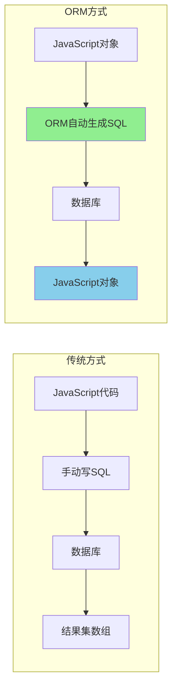
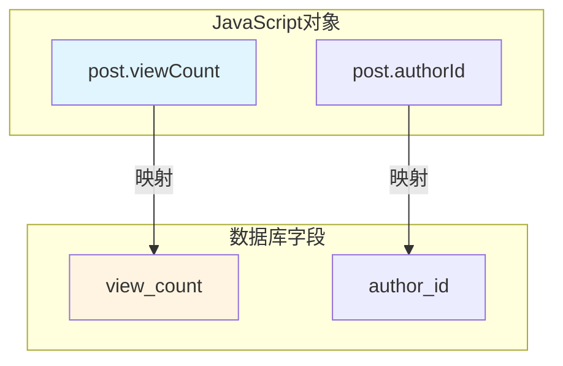

---
tags:
  - 数据库
  - ORM
  - Sequelize
  - E领域
创建时间: 2026-03-25
更新时间: 2026-03-25
掌握程度: ✅ 已掌握
相关主题: [[Sequelize模型定义]] [[Sequelize模型关联]] [[Sequelize CRUD操作]]
难度: ⭐⭐⭐
重要性: ⭐⭐⭐⭐⭐
---

# ORM基础与Sequelize介绍

## 📚 核心概念

**ORM (Object-Relational Mapping)** = 对象关系映射，一种将数据库表映射成编程语言对象的技术。

**本质**：把数据库行变成JavaScript对象

---

## 🤔 什么是ORM？

### 类比理解

```
传统方式（mysql2）:
数据库表 → SQL字符串 → 结果集数组
SELECT * FROM users WHERE id = ?

ORM方式（Sequelize）:
数据库表 → JavaScript对象 → JavaScript对象
User.findOne({ where: { id } })
```

### 使用Vue/React类比

```
就像Vue/React把DOM操作变成声明式渲染：

// 原生DOM（繁琐）
const div = document.createElement('div')
div.textContent = 'Hello'

// React（简洁）
<div>Hello</div>

// 同样，ORM把繁琐的SQL变成简洁的JS：

// mysql2（繁琐）
const [rows] = await pool.query(
  'SELECT * FROM users WHERE username = ?',
  [username]
)

// Sequelize（简洁）
const user = await User.findOne({
  where: { username }
})
```

---

## ⭐ 为什么需要ORM？

### 1️⃣ 代码简洁 ✨

**mysql2方式**:
```javascript
const [users] = await pool.query(
  'SELECT id, username, email FROM users WHERE status = ? ORDER BY created_at DESC LIMIT 10',
  ['active']
)
```

**Sequelize方式**:
```javascript
const users = await User.findAll({
  where: { status: 'active' },
  order: [['created_at', 'DESC']],
  limit: 10
})
```

### 2️⃣ 可读性 📖

```javascript
// Sequelize：读起来像英语
const posts = await Post.findAll({
  where: { status: 'published' },
  include: [{ model: User, as: 'author' }]
})

// vs SQL：需要解析复杂的JOIN语法
const [posts] = await pool.query(`
  SELECT p.*, u.username, u.nickname
  FROM posts p
  LEFT JOIN users u ON p.author_id = u.id
  WHERE p.status = 'published'
`)
```

### 3️⃣ 数据库无关 🔄

```javascript
// Sequelize代码不依赖具体数据库
const users = await User.findAll()

// 可以轻松切换数据库：
// - MySQL → PostgreSQL → SQLite → MariaDB
// 只需修改配置，不需要改代码
```

---

## ⚖️ Sequelize vs mysql2对比

### 返回值差异

**mysql2**:
```javascript
const [rows, fields] = await pool.query('SELECT * FROM users WHERE id = ?', [1])
// rows是数组: [{ id: 1, username: 'admin' }]
const user = rows[0]
```

**Sequelize**:
```javascript
const user = await User.findOne({ where: { id: 1 } })
// user是对象: { id: 1, username: 'admin' }
// 直接访问属性即可
```

### INSERT差异

**mysql2**:
```javascript
const [result] = await pool.query(
  'INSERT INTO users (username, password) VALUES (?, ?)',
  ['admin', 'hashed_password']
)
const newId = result.insertId  // 从result元信息中获取
```

**Sequelize**:
```javascript
const newUser = await User.create({
  username: 'admin',
  password: 'hashed_password'
})
const newId = newUser.id  // 直接从数据对象中获取
```

---

## 🏗️ Sequelize核心概念

### 1️⃣ 模型（Model）

模型对应数据库的一张表：

```javascript
const User = sequelize.define('User', {
  id: {
    type: DataTypes.INTEGER,
    primaryKey: true,
    autoIncrement: true
  },
  username: {
    type: DataTypes.STRING(50),
    allowNull: false,
    unique: true
  }
}, {
  tableName: 'users',
  timestamps: true  // 自动管理created_at和updated_at
})
```

### 2️⃣ 字段映射（Field Mapping）

**驼峰命名 → 蛇形命名**:

```javascript
const Post = sequelize.define('Post', {
  viewCount: {
    type: DataTypes.INTEGER,
    field: 'view_count',      // 映射到数据库字段名
    defaultValue: 0
  },
  authorId: {
    type: DataTypes.INTEGER,
    field: 'author_id'        // 映射到数据库字段名
  }
})

// JavaScript中使用驼峰：post.viewCount
// 数据库中存储蛇形：view_count
```

### 3️⃣ 时间戳（Timestamps）

```javascript
{
  timestamps: true,           // 启用自动时间戳
  createdAt: 'created_at',    // 自定义字段名
  updatedAt: 'updated_at'     // 自定义字段名
}
// Sequelize自动管理这两个字段
```

---

## 📦 安装和配置

### 安装依赖

```bash
npm install sequelize
npm install mysql2  # 驱动程序
```

### 配置数据库连接

```javascript
const { Sequelize } = require('sequelize');

const sequelize = new Sequelize(
  'database_name',
  'username',
  'password',
  {
    host: 'localhost',
    dialect: 'mysql',
    logging: false,

    // 连接池配置
    pool: {
      max: 10,         // 最大连接数
      min: 0,          // 最小连接数
      acquire: 30000,  // 获取连接超时（30秒）
      idle: 10000      // 空闲超时（10秒）
    }
  }
);
```

---

## 🎯 常用DataTypes

```javascript
DataTypes.INTEGER           // 整数
DataTypes.STRING(50)        // 变长字符串
DataTypes.TEXT              // 长文本
DataTypes.BOOLEAN           // 布尔值
DataTypes.DATE              // 日期时间
DataTypes.ENUM('a', 'b')    // 枚举值
DataTypes.FLOAT             // 浮点数
DataTypes.JSON              // JSON类型（MySQL 5.7+）
```

---

## ⚠️ 常见错误

### ❌ 错误1: 导入方式错误

```javascript
// ❌ 错误
const sequelize = require('../config/sequelize');
const User = sequelize.define('User', {...});
// TypeError: sequelize.define is not a function

// ✅ 正确（解构导入）
const { sequelize } = require('../config/sequelize');
const User = sequelize.define('User', {...});
```

### ❌ 错误2: 循环引用错误

```javascript
const post = await Post.findOne({
  include: [{ model: User, as: 'author' }]
})

// ❌ 错误
res.json({ success: true, data: post })
// TypeError: Converting circular structure to JSON

// ✅ 正确
res.json({ success: true, data: post.toJSON() })
```

---

## ✅ 最佳实践

### 推荐做法

1. ✅ **使用字段映射**（驼峰↔蛇形）
   ```javascript
   viewCount: { type: DataTypes.INTEGER, field: 'view_count' }
   ```

2. ✅ **启用时间戳**
   ```javascript
   timestamps: true
   ```

3. ✅ **使用toJSON()解决循环引用**
   ```javascript
   res.json({ data: post.toJSON() })
   ```

4. ✅ **合理配置连接池**
   ```javascript
   pool: { max: 10, min: 0, acquire: 30000, idle: 10000 }
   ```

### 避免做法

1. ❌ 不使用字段映射（数据库字段名不统一）
2. ❌ 直接返回模型实例（循环引用错误）
3. ❌ 连接池配置过大或过小
4. ❌ 忘记配置时间戳

---

## 🎨 可视化图表

### ORM工作原理



### 字段映射示意图



---

## 🔗 相关主题

- [[Sequelize模型定义]] - 如何定义模型
- [[Sequelize模型关联]] - 一对多、多对多关联
- [[Sequelize CRUD操作]] - 增删改查完整流程
- [[连接池配置详解]] - 连接池原理和配置
- [[易错点：Sequelize循环引用错误]] - toJSON()解决方案

---

## 💡 关键要点

1. ✅ **ORM本质**: 把数据库行映射成JavaScript对象
2. ✅ **Sequelize优势**: 代码简洁、可读性高、数据库无关
3. ✅ **字段映射**: 驼峰命名 ↔ 蛇形命名
4. ✅ **时间戳**: timestamps自动管理created_at和updated_at
5. ✅ **返回值差异**: mysql2返回元信息，Sequelize返回数据对象
6. ✅ **循环引用**: 使用toJSON()转换模型实例

---

**学习日期**: 2026-03-25
**掌握程度**: ⭐⭐⭐⭐⭐
**复习频率**: 每周复习一次
**实战项目**: [[../../projects/11-personal-blog]]
