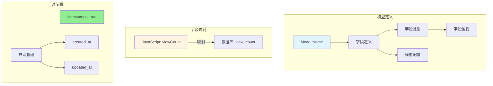
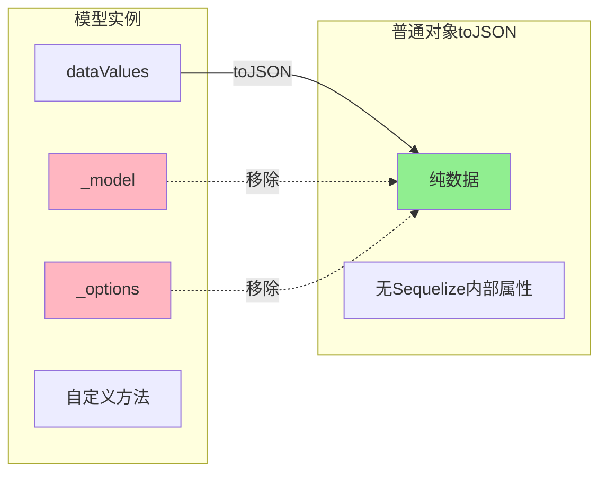

---
tags:
  - 数据库
  - ORM
  - Sequelize
  - 模型定义
  - E领域
创建时间: 2026-03-25
更新时间: 2026-03-25
掌握程度: ✅ 已掌握
相关主题: [[ORM基础与Sequelize介绍]] [[Sequelize模型关联]]
难度: ⭐⭐⭐⭐
重要性: ⭐⭐⭐⭐⭐
---

# Sequelize模型定义

## 📚 核心概念

**模型（Model）** = Sequelize中对应数据库一张表的类，包含字段定义、关联关系、配置选项。

**本质**：JavaScript类 + 数据库表的映射

---

## 🏗️ 模型定义基础

### 基本语法

```javascript
const ModelName = sequelize.define('ModelName', {
  // 字段定义
}, {
  // 模型配置
});
```

### 完整示例：User模型

```javascript
const { DataTypes } = require('sequelize');
const { sequelize } = require('../config/sequelize');

const User = sequelize.define('User', {
  // 字段定义
  id: {
    type: DataTypes.INTEGER,
    primaryKey: true,
    autoIncrement: true
  },
  username: {
    type: DataTypes.STRING(50),
    allowNull: false,
    unique: true,
    comment: '用户名'
  },
  password: {
    type: DataTypes.STRING(255),
    allowNull: false,
    comment: '密码(bcrypt加密)'
  },
  email: {
    type: DataTypes.STRING(100),
    allowNull: false,
    unique: true,
    comment: '邮箱'
  },
  nickname: {
    type: DataTypes.STRING(50),
    allowNull: true,
    defaultValue: null,
    comment: '昵称'
  },
  avatar: {
    type: DataTypes.STRING(255),
    allowNull: true,
    defaultValue: null,
    comment: '头像URL'
  },
  bio: {
    type: DataTypes.TEXT,
    allowNull: true,
    defaultValue: null,
    comment: '个人简介'
  }
}, {
  // 模型配置
  tableName: 'users',              // 指定表名
  timestamps: true,                // 自动管理created_at和updated_at
  createdAt: 'created_at',         // 自定义创建时间字段名
  updatedAt: 'updated_at',         // 自定义更新时间字段名
  charset: 'utf8mb4',              // 字符集
  collate: 'utf8mb4_unicode_ci'    // 排序规则
});

module.exports = User;
```

---

## 📋 字段类型（DataTypes）

### 1️⃣ 常用类型

```javascript
DataTypes.INTEGER           // 整数 (INT)
DataTypes.BIGINT            // 大整数 (BIGINT)
DataTypes.STRING(50)        // 变长字符串 (VARCHAR)
DataTypes.TEXT              // 长文本 (TEXT)
DataTypes.BOOLEAN           // 布尔值 (TINYINT(1))
DataTypes.DATE              // 日期时间 (DATETIME)
DataTypes.FLOAT             // 浮点数 (FLOAT)
DataTypes.DOUBLE            // 双精度 (DOUBLE)
DataTypes.DECIMAL(10, 2)    // 精确小数 (DECIMAL)
DataTypes.ENUM('a', 'b')    // 枚举 (ENUM)
DataTypes.JSON              // JSON类型 (MySQL 5.7+)
DataTypes.UUID              // UUID字符串
DataTypes.UUIDV4            // UUID v4生成
DataTypes.NOW               // 当前时间戳
```

### 2️⃣ 字段属性

```javascript
{
  type: DataTypes.STRING(50),     // 字段类型
  allowNull: false,                // 是否允许NULL
  defaultValue: null,              // 默认值
  unique: true,                   // 是否唯一
  primaryKey: true,                // 是否主键
  autoIncrement: true,             // 是否自增
  comment: '用户名',                // 字段注释
  field: 'user_name',              // 数据库字段名（映射）
  validate: {                      // 验证规则
    isEmail: true,
    len: [6, 20]
  }
}
```

---

## 🔄 字段映射（Field Mapping）

### 为什么需要字段映射？

JavaScript习惯**驼峰命名**（camelCase），数据库习惯**蛇形命名**（snake_case）。

```javascript
// JavaScript习惯
viewCount
authorId
coverImage

// 数据库习惯
view_count
author_id
cover_image
```

### 如何使用字段映射

```javascript
const Post = sequelize.define('Post', {
  viewCount: {
    type: DataTypes.INTEGER,
    field: 'view_count',      // 映射到数据库字段名
    defaultValue: 0
  },
  authorId: {
    type: DataTypes.INTEGER,
    field: 'author_id'        // 映射到数据库字段名
  },
  coverImage: {
    type: DataTypes.STRING(255),
    field: 'cover_image'      // 映射到数据库字段名
  }
});

// 使用时
const post = await Post.findOne()
console.log(post.viewCount)   // ✅ 驼峰命名
// 数据库中存储为 view_count
```

---

## ⏰ 时间戳（Timestamps）

### 自动时间戳

```javascript
{
  timestamps: true,           // 启用自动时间戳
  createdAt: 'created_at',    // 自定义创建时间字段
  updatedAt: 'updated_at',    // 自定义更新时间字段
  deletedAt: 'deleted_at',     // 软删除字段（paranoid模式）
}
```

### 工作原理

```javascript
// 创建记录时
const user = await User.create({ username: 'admin' })
// Sequelize自动设置: created_at = NOW(), updated_at = NOW()

// 更新记录时
await user.update({ username: 'admin2' })
// Sequelize自动更新: updated_at = NOW()

// 不需要手动设置时间戳！
```

### 禁用时间戳

```javascript
{
  timestamps: false           // 完全禁用
}

// 或者只禁用某个
{
  updatedAt: false            // 只禁用updated_at
}
```

### 某些表不需要updated_at

```javascript
// 评论表通常不需要更新时间
const Comment = sequelize.define('Comment', {
  content: DataTypes.TEXT
}, {
  updatedAt: false            // 不添加updated_at字段
});
```

---

## ⚙️ 模型配置选项

### 完整配置列表

```javascript
{
  // 表名配置
  tableName: 'users',           // 指定表名（默认是模型名的复数形式）
  freezeTableName: true,        // 禁止自动复数化（User → users）

  // 时间戳配置
  timestamps: true,             // 启用时间戳
  createdAt: 'created_at',      // 创建时间字段名
  updatedAt: 'updated_at',      // 更新时间字段名
  deletedAt: 'deleted_at',      // 软删除字段名（paranoid模式）

  // 字符集配置
  charset: 'utf8mb4',           // 字符集
  collate: 'utf8mb4_unicode_ci', // 排序规则

  // 其他配置
  paranoid: false,              // 软删除模式（添加deleted_at）
  underscored: false,           // 所有字段使用蛇形命名
  sync: false,                  // 自动同步模型到数据库（慎用）
}
```

### underscored选项

```javascript
// 如果数据库全部使用蛇形命名
const User = sequelize.define('User', {
  firstName: DataTypes.STRING,   // 自动映射到 first_name
  lastName: DataTypes.STRING     // 自动映射到 last_name
}, {
  underscored: true              // 启用自动蛇形映射
});
```

---

## 🔧 模型方法

### 静态方法（Model级别）

```javascript
// 查询
User.findOne({ where: { id } })
User.findAll({ where: { status: 'active' }})
User.findAndCountAll({ where: { status }})  // 分页查询
User.count({ where: { status: 'active' }})

// 创建
User.create({ username, password })

// 更新
User.update({ username }, { where: { id }})

// 删除
User.destroy({ where: { id }})
```

### 实例方法（实例级别）

```javascript
const user = await User.findOne()

// 更新
await user.update({ username: 'new' })

// 删除
await user.destroy()

// 重新加载
await user.reload()

// 保存
await user.save()

// 转换为JSON
const json = user.toJSON()
```

---

## ⚠️ 常见错误

### ❌ 错误1: 导入方式错误

```javascript
// ❌ 错误
const sequelize = require('../config/sequelize');
const User = sequelize.define('User', {...});
// TypeError: sequelize.define is not a function

// ✅ 正确（解构导入）
const { sequelize } = require('../config/sequelize');
const User = sequelize.define('User', {...});
```

**原因**: sequelize.js导出的是`{ sequelize, testConnection }`对象，不是sequelize本身

### ❌ 错误2: 循环引用错误

```javascript
const post = await Post.findOne({
  include: [{
    model: User,
    as: 'author',
    include: [{
      model: Post,
      as: 'posts'     // ← 这里会导致循环
    }]
  }]
});

// ❌ 错误
res.json({ success: true, data: post })
// TypeError: Converting circular structure to JSON

// ✅ 正确
res.json({ success: true, data: post.toJSON() })
```

---

## ✅ 最佳实践

### 推荐做法

1. ✅ **使用字段映射**（保持命名规范一致）
   ```javascript
   viewCount: { type: DataTypes.INTEGER, field: 'view_count' }
   ```

2. ✅ **启用时间戳**（自动管理）
   ```javascript
   timestamps: true
   ```

3. ✅ **添加字段注释**（便于理解）
   ```javascript
   username: { type: DataTypes.STRING(50), comment: '用户名' }
   ```

4. ✅ **使用toJSON()**（解决循环引用）
   ```javascript
   res.json({ data: user.toJSON() })
   ```

5. ✅ **合理设置默认值**
   ```javascript
   status: { type: DataTypes.ENUM('draft', 'published'), defaultValue: 'draft' }
   ```

### 避免做法

1. ❌ 不使用字段映射（命名混乱）
2. ❌ 直接返回模型实例（循环引用错误）
3. ❌ 忘记设置timestamps（缺少时间戳）
4. ❌ 过度使用sync：true（自动同步危险）
5. ❌ 不设置字段注释（难以维护）

---

## 🎨 可视化图表

### 模型定义结构



### 模型实例 vs 普通对象



---

## 🔗 相关主题

- [[ORM基础与Sequelize介绍]] - ORM概念和原理
- [[Sequelize模型关联]] - 一对多、多对多关联
- [[Sequelize CRUD操作]] - 增删改查完整流程
- [[易错点：Sequelize循环引用错误]] - toJSON()详解

---

## 💡 关键要点

1. ✅ **掌握定义语法**: `sequelize.define('ModelName', fields, options)`
2. ✅ **理解字段类型**: DataTypes的常用类型和属性
3. ✅ **掌握字段映射**: 驼峰命名 ↔ 蛇形命名
4. ✅ **理解时间戳**: timestamps自动管理created_at和updated_at
5. ✅ **理解静态vs实例**: 静态需要where，实例不需要
6. ✅ **解决循环引用**: 使用toJSON()转换
7. ✅ **避免常见错误**: 解构导入、使用toJSON()

---

## 📝 实战项目示例

### 博客项目的三个模型

**1. User模型**:
```javascript
const User = sequelize.define('User', {
  id: { type: DataTypes.INTEGER, primaryKey: true, autoIncrement: true },
  username: { type: DataTypes.STRING(50), allowNull: false, unique: true },
  password: { type: DataTypes.STRING(255), allowNull: false },
  email: { type: DataTypes.STRING(100), allowNull: false, unique: true },
  nickname: { type: DataTypes.STRING(50), defaultValue: null },
  avatar: { type: DataTypes.STRING(255), defaultValue: null },
  bio: { type: DataTypes.TEXT, defaultValue: null }
}, {
  tableName: 'users',
  timestamps: true,
  createdAt: 'created_at',
  updatedAt: 'updated_at'
});
```

**2. Post模型**:
```javascript
const Post = sequelize.define('Post', {
  id: { type: DataTypes.INTEGER, primaryKey: true, autoIncrement: true },
  title: { type: DataTypes.STRING(200), allowNull: false },
  content: { type: DataTypes.TEXT, allowNull: false },
  coverImage: { type: DataTypes.STRING(255), field: 'cover_image', defaultValue: null },
  authorId: { type: DataTypes.INTEGER, field: 'author_id', allowNull: false },
  viewCount: { type: DataTypes.INTEGER, field: 'view_count', defaultValue: 0 },
  status: { type: DataTypes.ENUM('draft', 'published'), defaultValue: 'draft' }
}, {
  tableName: 'posts',
  timestamps: true,
  createdAt: 'created_at',
  updatedAt: 'updated_at'
});
```

**3. Comment模型**:
```javascript
const Comment = sequelize.define('Comment', {
  id: { type: DataTypes.INTEGER, primaryKey: true, autoIncrement: true },
  postId: { type: DataTypes.INTEGER, field: 'post_id', allowNull: false },
  userId: { type: DataTypes.INTEGER, field: 'user_id', allowNull: false },
  content: { type: DataTypes.TEXT, allowNull: false }
}, {
  tableName: 'comments',
  timestamps: true,
  createdAt: 'created_at',
  updatedAt: false  // 评论不需要更新时间
});
```

---

**学习日期**: 2026-03-25
**掌握程度**: ⭐⭐⭐⭐⭐
**复习频率**: 每周复习一次
**实战项目**: [[../../projects/11-personal-blog]]
