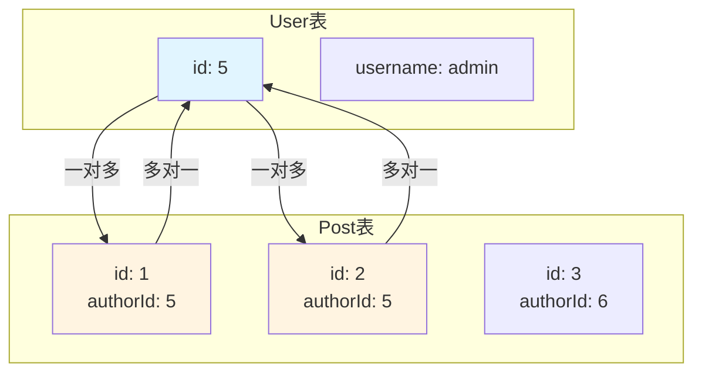
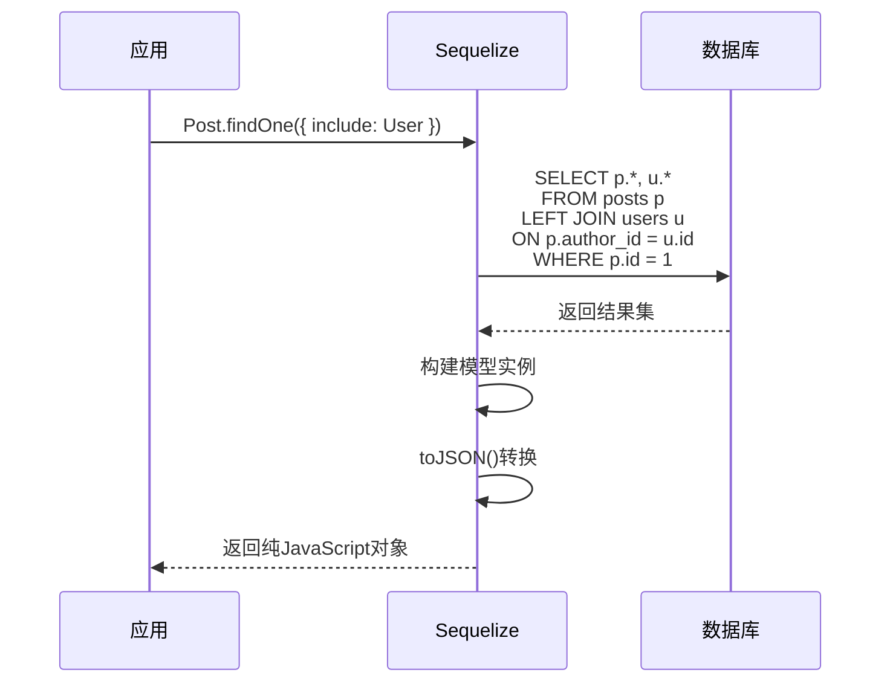
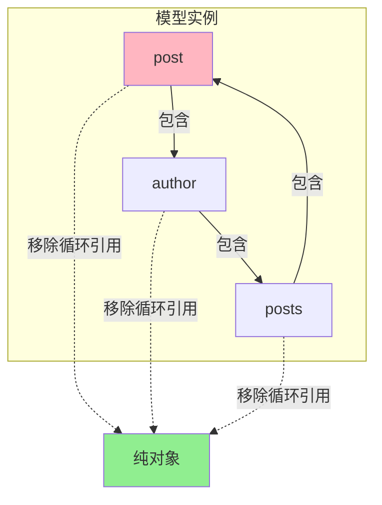

---
tags:
  - 数据库
  - ORM
  - Sequelize
  - 模型关联
  - E领域
创建时间: 2026-03-25
更新时间: 2026-03-25
掌握程度: ✅ 已掌握
相关主题: [[ORM基础与Sequelize介绍]] [[Sequelize模型定义]] [[Sequelize CRUD操作]]
难度: ⭐⭐⭐⭐
重要性: ⭐⭐⭐⭐⭐
---

# Sequelize模型关联

## 📚 核心概念

**模型关联（Association）** = 定义不同模型之间的关系，如一对一、一对多、多对多。

**本质**：通过外键连接不同的表

---

## 🔗 三种关联类型

### 1️⃣ 一对一（One-to-One）

```
用户 ↔ 用户资料
一个用户只有一个资料
```

### 2️⃣ 一对多（One-to-Many）⭐

```
用户 ↔ 文章
一个用户可以写多篇文章
一篇文章只属于一个用户
```

### 3️⃣ 多对多（Many-to-Many）

```
文章 ↔ 标签
一篇文章可以有多个标签
一个标签可以用于多篇文章
```

---

## 👥 一对多关联（最常用）

### 示例：User ↔ Post

```javascript
// User.hasMany(Post)
// 一个用户有多篇文章
User.hasMany(Post, {
  foreignKey: 'authorId',      // Post表中的外键字段
  as: 'posts'                  // 别名，用于查询时引用
});

// Post.belongsTo(User)
// 一篇文章属于一个用户
Post.belongsTo(User, {
  foreignKey: 'authorId',      // Post表中的外键字段
  as: 'author'                 // 别名，用于查询时引用
});
```

### foreignKey说明

```javascript
// Post表结构
+----+-----------+----------+
| id | authorId  | title    |
+----+-----------+----------+
| 1  | 5         | 文章1    |
| 2  | 5         | 文章2    |
+----+-----------+----------+
      ↑
  foreignKey指向User表

// User表结构
+----+----------+
| id | username |
+----+----------+
| 5  | admin    |
+----+----------+
```

### as别名的作用

```javascript
// 定义关联时设置as
User.hasMany(Post, { as: 'posts' })
Post.belongsTo(User, { as: 'author' })

// 查询时必须使用相同的as
const user = await User.findOne({
  include: [{
    model: Post,
    as: 'posts'  // 必须匹配定义时的as
  }]
})
```

**为什么需要as？**
- ✅ 避免默认名称冲突（如都有user、user）
- ✅ 提供语义化的名称（posts、author）
- ✅ 区分不同的关联关系

---

## 🔍 查询关联数据

### 1️⃣ 单层关联查询

**查询文章及其作者**:

```javascript
const post = await Post.findOne({
  where: { id: 1 },
  include: [{
    model: User,
    as: 'author',
    attributes: ['username', 'nickname', 'avatar']  // 只选择需要的字段
  }]
});

// 返回结果
{
  id: 1,
  title: '文章标题',
  authorId: 5,
  author: {                     // ← 关联的作者信息
    username: 'admin',
    nickname: '管理员',
    avatar: 'avatar.jpg'
  }
}
```

### 2️⃣ 多层关联查询

**查询文章及其作者（包含作者资料）**:

```javascript
const post = await Post.findOne({
  where: { id: 1 },
  include: [{
    model: User,
    as: 'author',
    attributes: ['username', 'nickname'],
    include: [{                      // ← 嵌套include
      model: Profile,
      as: 'profile'
    }]
  }]
});
```

---

## 📄 分页查询 + 关联查询

### 博客文章列表（分页+包含作者信息）

```javascript
const page = 1;
const pageSize = 10;
const offset = (page - 1) * pageSize;

const { rows, count } = await Post.findAndCountAll({
  where: { status: 'published' },     // 只查询已发布文章
  include: [{
    model: User,
    as: 'author',
    attributes: ['username', 'nickname', 'avatar']  // 只要这些字段
  }],
  order: [['created_at', 'DESC']],     // 按创建时间倒序
  limit: parseInt(pageSize),           // 每页数量
  offset: offset                       // 跳过数量
});

// rows: 文章数组
// count: 总记录数
```

---

## 🎯 attributes字段选择

### 为什么需要attributes？

**性能优化**: 只查询需要的字段，减少数据传输

```javascript
// ❌ 查询所有字段（包括password）
const post = await Post.findOne({
  include: [{
    model: User,
    as: 'author'
    // 默认查询User所有字段，包括password！
  }]
})

// ✅ 只查询需要的字段
const post = await Post.findOne({
  include: [{
    model: User,
    as: 'author',
    attributes: ['username', 'nickname', 'avatar']
    // 只查询这3个字段，不查询password、email等
  }]
})
```

### 排除敏感字段

```javascript
// 方式1: 明确指定需要的字段（推荐）
attributes: ['username', 'nickname', 'avatar']

// 方式2: 排除某些字段
attributes: {
  exclude: ['password', 'email']
}
```

---

## 🔄 循环引用问题

### 问题示例

```javascript
const post = await Post.findOne({
  include: [{
    model: User,
    as: 'author',
    include: [{
      model: Post,
      as: 'posts'     // ← 这里会导致循环
    }]
  }]
});

// post → author → posts → post → author → ...
// 形成循环引用
```

### 错误信息

```
TypeError: Converting circular structure to JSON
    at JSON.stringify (<anonymous>)
```

### ✅ 解决方案

```javascript
// 使用toJSON()
res.json({
  success: true,
  data: post.toJSON()  // ← 转换为纯JavaScript对象
});
```

**工作原理**:
- `findOne()`返回模型实例（包含Sequelize内部属性）
- `findAndCountAll()`返回纯对象（自动toJSON）
- `toJSON()`移除循环引用和内部属性

---

## ⚠️ 常见错误

### ❌ 错误1: 忘记使用as别名

```javascript
// 定义关联时
User.hasMany(Post, { as: 'posts' });

// ❌ 错误：忘记使用as
const user = await User.findOne({
  include: [Post]  // 没有as
});
// 抛出错误：Error: Association 'Post' not found

// ✅ 正确：使用as
const user = await User.findOne({
  include: [{ model: Post, as: 'posts' }]
});
```

### ❌ 错误2: 循环引用

```javascript
// ❌ 错误：直接返回模型实例
res.json({ data: post })

// ✅ 正确：使用toJSON()
res.json({ data: post.toJSON() })
```

### ❌ 错误3: 导入方式错误

```javascript
// ❌ 错误
const sequelize = require('../config/sequelize');
const User = sequelize.define('User', {...});

// ✅ 正确（解构导入）
const { sequelize } = require('../config/sequelize');
const User = sequelize.define('User', {...});
```

---

## ✅ 最佳实践

### 推荐做法

1. ✅ **使用语义化的as别名**
   ```javascript
   User.hasMany(Post, { as: 'posts' })    // 清晰
   Post.belongsTo(User, { as: 'author' }) // 清晰
   ```

2. ✅ **使用attributes限制字段**
   ```javascript
   attributes: ['username', 'nickname', 'avatar']
   ```

3. ✅ **使用toJSON()解决循环引用**
   ```javascript
   res.json({ data: post.toJSON() })
   ```

4. ✅ **合理使用嵌套include**
   ```javascript
   // 最多2-3层，避免过深
   include: [{ model: User, as: 'author' }]
   ```

### 避免做法

1. ❌ 忘记使用as别名
2. ❌ 直接返回模型实例（循环引用错误）
3. ❌ 查询过多字段（性能问题）
4. ❌ 过深的嵌套include（3层以上）
5. ❌ 不使用attributes限制（泄露敏感信息）

---

## 🎨 可视化图表

### 一对多关联结构



### 关联查询流程



### 循环引用问题



---

## 🔗 相关主题

- [[ORM基础与Sequelize介绍]] - ORM概念和原理
- [[Sequelize模型定义]] - 如何定义模型
- [[Sequelize CRUD操作]] - 增删改查完整流程
- [[易错点：Sequelize循环引用错误]] - toJSON()详解

---

## 💡 关键要点

1. ✅ **理解三种关联**: 一对一、一对多、多对多
2. ✅ **掌握一对多关联**: hasMany + belongsTo
3. ✅ **理解foreignKey**: 外键指向关联表
4. ✅ **掌握as别名**: 避免名称冲突，提供语义化名称
5. ✅ **理解include**: LEFT JOIN联表查询
6. ✅ **掌握attributes**: 字段选择，性能优化
7. ✅ **解决循环引用**: 使用toJSON()转换
8. ✅ **实战应用**: 分页查询、多层关联、字段排除

---

## 📝 实战应用场景

### 场景1: 文章列表页（分页+作者信息）

```javascript
// GET /api/posts?page=1&pageSize=10
const { rows, count } = await Post.findAndCountAll({
  where: { status: 'published' },
  include: [{
    model: User,
    as: 'author',
    attributes: ['username', 'nickname', 'avatar']
  }],
  order: [['created_at', 'DESC']],
  limit: 10,
  offset: 0
});
```

### 场景2: 文章详情页（+作者信息+浏览次数）

```javascript
// GET /api/posts/:id
const post = await Post.findOne({
  where: { id },
  include: [{
    model: User,
    as: 'author',
    attributes: ['username', 'nickname', 'avatar']
  }]
});

await post.increment('viewCount');

res.json({
  success: true,
  data: post.toJSON()  // ← 关键！使用toJSON()
});
```

---

**学习日期**: 2026-03-25
**掌握程度**: ⭐⭐⭐⭐⭐
**复习频率**: 每周复习一次
**实战项目**: [[../../projects/11-personal-blog]]
