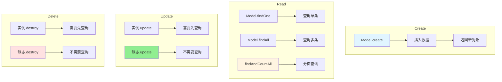
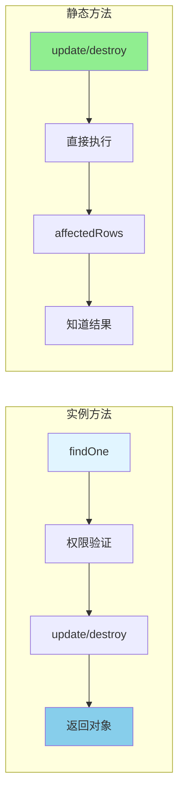

---
tags:
  - 数据库
  - ORM
  - Sequelize
  - CRUD操作
  - E领域
创建时间: 2026-03-25
更新时间: 2026-03-25
掌握程度: ✅ 已掌握
相关主题: [[ORM基础与Sequelize介绍]] [[Sequelize模型定义]] [[Sequelize模型关联]]
难度: ⭐⭐⭐⭐
重要性: ⭐⭐⭐⭐⭐
---

# Sequelize CRUD操作

## 📚 核心概念

**CRUD** = Create（创建）、Read（读取）、Update（更新）、Delete（删除）

---

## ➕ Create（创建）

### 基本语法

```javascript
const newUser = await Model.create({
  field1: 'value1',
  field2: 'value2'
});
```

### 示例：注册用户

```javascript
const register = async (req, res) => {
  const { username, password, email } = req.body;

  // 检查用户是否存在
  const existingUser = await User.findOne({
    where: { username: username }
  });

  if (existingUser) {
    return res.status(400).json({
      success: false,
      message: '用户名已存在'
    });
  }

  // 创建新用户
  const newUser = await User.create({
    username: username,
    password: hashedPassword,
    email: email
  });

  res.status(201).json({
    success: true,
    message: '注册成功',
    data: {
      id: newUser.id,          // ← 直接访问id属性
      username: newUser.username
    }
  });
};
```

### mysql2 vs Sequelize对比

**mysql2**:
```javascript
const [result] = await pool.query(
  'INSERT INTO users (username, password, email) VALUES (?, ?, ?)',
  [username, password, email]
);
const newId = result.insertId;  // 从result元信息中获取
```

**Sequelize**:
```javascript
const newUser = await User.create({
  username, password, email
});
const newId = newUser.id;  // 直接从数据对象中获取
```

**关键差异**:
- mysql2返回元信息`result.insertId`
- Sequelize返回数据对象`newUser.id`

---

## 👁 Read（读取）

### 1️⃣ findOne - 查询单条记录

```javascript
const user = await User.findOne({
  where: { username: 'admin' }
});

if (user) {
  console.log(user.username);
} else {
  console.log('用户不存在');
}
```

**where条件**:
```javascript
// 单条件
where: { username: 'admin' }

// 多条件（AND）
where: {
  username: 'admin',
  status: 'active'
}
```

### 2️⃣ findAll - 查询多条记录

```javascript
const users = await User.findAll({
  where: { status: 'active' },
  order: [['created_at', 'DESC']],
  limit: 10
});
```

### 3️⃣ findAndCountAll - 分页查询 ⭐

```javascript
const { rows, count } = await Post.findAndCountAll({
  where: { status: 'published' },
  include: [{
    model: User,
    as: 'author',
    attributes: ['username', 'nickname', 'avatar']
  }],
  order: [['created_at', 'DESC']],
  limit: 10,
  offset: 0
});

// rows: 当前页数据
// count: 总记录数
```

**为什么用findAndCountAll？**
- ✅ 一次查询获取数据和总数
- ✅ 避免两次查询（先count再findAll）
- ✅ 性能更好

---

## ✏️ Update（更新）

### 方式1: 实例方法（需要先查询）⭐

```javascript
const post = await Post.findOne({ where: { id } });

if (!post) {
  return res.status(404).json({
    success: false,
    message: '文章不存在'
  });
}

// 权限验证
if (post.authorId !== req.user.id) {
  return res.status(403).json({
    success: false,
    message: '无权编辑此文章'
  });
}

// 更新
await post.update({
  title: title,
  content: content,
  status: status
});

res.json({
  success: true,
  message: '更新成功',
  data: post.toJSON()
});
```

**优点**:
- ✅ 代码直观
- ✅ 适合需要权限验证的场景（反正要查询）
- ✅ 自动更新updated_at

### 方式2: 静态方法（不需要查询）

```javascript
const [affectedRows] = await Post.update(
  { status: 'published' },
  { where: { id: id } }
);

if (affectedRows === 0) {
  return res.status(404).json({
    success: false,
    message: '文章不存在'
  });
}

res.json({
  success: true,
  message: '更新成功'
});
```

**优点**:
- ✅ 性能更好（不需要先查询）
- ✅ 适合不需要权限验证的场景

### 如何选择？

| 场景 | 推荐方式 | 原因 |
|------|----------|------|
| 需要权限验证 | 实例方法 | 反正要查询 |
| 管理员操作 | 静态方法 | 性能更好 |
| 需要返回更新后对象 | 实例方法 | 直接有对象 |
| 批量更新 | 静态方法 | 性能好 |

---

## 🗑️ Delete（删除）

### 方式1: 实例方法

```javascript
const post = await Post.findOne({ where: { id } });

if (!post) {
  return res.status(404).json({
    success: false,
    message: '文章不存在'
  });
}

// 权限验证
if (post.authorId !== req.user.id) {
  return res.status(403).json({
    success: false,
    message: '无权删除此文章'
  });
}

// 删除
await post.destroy();

res.json({
  success: true,
  message: '删除成功'
});
```

### 方式2: 静态方法

```javascript
const affectedRows = await Post.destroy({
  where: { id: id }
});

if (affectedRows === 0) {
  return res.status(404).json({
    success: false,
    message: '文章不存在'
  });
}
```

---

## 🔄 特殊操作

### increment - 字段值增加

```javascript
// 浏览次数+1
await post.increment('viewCount');

// 指定增加量
await post.increment('viewCount', { by: 5 });

// 多个字段
await post.increment(['viewCount', 'likeCount'], { by: 1 });
```

### decrement - 字段值减少

```javascript
// 库存-1
await product.decrement('stock');
```

---

## ⚠️ 常见错误

### ❌ 错误1: update忘记where

```javascript
// ❌ 错误：会更新所有记录！
await Post.update({ status: 'published' });

// ✅ 正确：添加where条件
await Post.update(
  { status: 'published' },
  { where: { id } }
);
```

### ❌ 错误2: 循环引用

```javascript
// ❌ 错误：直接返回模型实例
res.json({ data: post })

// ✅ 正确：使用toJSON()
res.json({ data: post.toJSON() })
```

### ❌ 错误3: 静态方法忘记检查affectedRows

```javascript
// ❌ 错误：不知道是否更新成功
await Post.update({ title }, { where: { id } });

// ✅ 正确：检查affectedRows
const [affectedRows] = await Post.update(
  { title },
  { where: { id } }
);
if (affectedRows === 0) {
  return res.status(404).json({ message: '不存在' });
}
```

---

## ✅ 最佳实践

### 推荐做法

1. ✅ **分页查询使用findAndCountAll**
   ```javascript
   const { rows, count } = await Model.findAndCountAll({...})
   ```

2. ✅ **需要权限验证用实例方法**
   ```javascript
   const post = await Post.findOne({ where: { id } });
   if (post.authorId !== req.user.id) {
     return res.status(403).json({ message: '无权' });
   }
   await post.update({...});
   ```

3. ✅ **使用toJSON()返回数据**
   ```javascript
   res.json({ data: post.toJSON() })
   ```

4. ✅ **使用increment/decrement更新计数**
   ```javascript
   await post.increment('viewCount')
   ```

### 避免做法

1. ❌ update/destroy忘记where条件（更新/删除所有数据）
2. ❌ 直接返回模型实例（循环引用错误）
3. ❌ 不检查affectedRows（不知道是否成功）
4. ❌ 不需要查询时用实例方法（性能浪费）

---

## 🎨 可视化图表

### CRUD操作流程



### 实例方法 vs 静态方法对比



---

## 🔗 相关主题

- [[ORM基础与Sequelize介绍]] - ORM概念和原理
- [[Sequelize模型定义]] - 如何定义模型
- [[Sequelize模型关联]] - 一对多、多对多关联
- [[易错点：Sequelize循环引用错误]] - toJSON()详解

---

## 💡 关键要点

1. ✅ **Create**: Model.create()返回数据对象
2. ✅ **Read**:
   - findOne: 查询单条
   - findAll: 查询多条
   - findAndCountAll: 分页查询
3. ✅ **Update**:
   - 实例方法：post.update()（适合权限验证）
   - 静态方法：Model.update()（性能更好）
4. ✅ **Delete**:
   - 实例方法：post.destroy()
   - 静态方法：Model.destroy()
5. ✅ **理解方法选择**: 根据是否需要查询、权限验证选择
6. ✅ **掌握特殊操作**: increment、decrement
7. ✅ **避免常见错误**: where条件、循环引用、affectedRows

---

## 📝 完整示例：博客CRUD

### 1. getPosts（文章列表）

```javascript
const getPosts = async (req, res) => {
  const { page = 1, pageSize = 10 } = req.query;
  const offset = (page - 1) * pageSize;

  try {
    const { rows, count } = await Post.findAndCountAll({
      where: { status: 'published' },
      include: [{
        model: User,
        as: 'author',
        attributes: ['username', 'nickname', 'avatar']
      }],
      order: [['created_at', 'DESC']],
      limit: parseInt(pageSize),
      offset: offset
    });

    res.json({
      success: true,
      data: {
        list: rows,
        total: count,
        page: parseInt(page),
        pageSize: parseInt(pageSize),
        totalPages: Math.ceil(count / pageSize)
      }
    });
  } catch (error) {
    res.status(500).json({
      success: false,
      message: '获取文章列表失败',
      error: error.message
    });
  }
};
```

### 2. getPostById（文章详情）

```javascript
const getPostById = async (req, res) => {
  const { id } = req.params;

  try {
    const post = await Post.findOne({
      where: { id },
      include: [{
        model: User,
        as: 'author',
        attributes: ['username', 'nickname', 'avatar']
      }]
    });

    if (!post) {
      return res.status(404).json({
        success: false,
        message: '文章不存在'
      });
    }

    // 浏览次数+1
    await post.increment('viewCount');

    res.json({
      success: true,
      data: post.toJSON()
    });
  } catch (error) {
    res.status(500).json({
      success: false,
      message: '获取文章详情失败',
      error: error.message
    });
  }
};
```

---

**学习日期**: 2026-03-25
**掌握程度**: ⭐⭐⭐⭐⭐
**复习频率**: 每周复习一次
**实战项目**: [[../../projects/11-personal-blog]]
