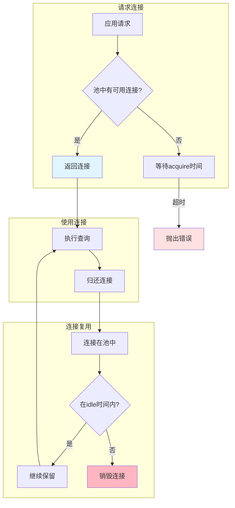
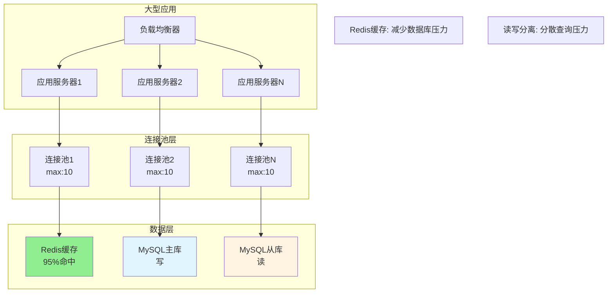

---
tags:
  - 数据库
  - 连接池
  - Sequelize
  - 性能优化
  - E领域
创建时间: 2026-03-25
更新时间: 2026-03-25
掌握程度: ✅ 已掌握
相关主题: [[ORM基础与Sequelize介绍]] [[Sequelize模型定义]]
难度: ⭐⭐⭐⭐
重要性: ⭐⭐⭐⭐
---

# 连接池配置详解

## 📚 核心概念

**连接池（Connection Pool）** = 一个缓存数据库连接的容器，允许应用程序重复使用现有的连接，而不是每次都建立新的连接。

**本质**：复用数据库连接，提高性能

---

## 🚴 什么是连接池？

### 类比：自行车租赁站

```
连接池就像一个自行车租赁站：

max: 10  =  共有10辆自行车（最大连接数）
min: 2   =  时刻保持2辆可用（最小连接数）
acquire: 30000  =  等待自行车的最长时间（30秒）
idle: 10000     =  自行车空闲多久后收回（10秒）

使用流程：
1. 来借车 → 从池中取车（获取连接）
2. 骑行 → 使用数据库
3. 还车 → 归还到池中（释放连接）
```

---

## 💡 为什么需要连接池？

### ❌ 不使用连接池的问题

```javascript
// 每次查询都创建新连接
const connection = await mysql.createConnection({...});
const [rows] = await connection.query('SELECT * FROM users');
await connection.end();

// 问题：
// 1. 建立连接慢（TCP三次握手 + MySQL认证）
// 2. 频繁创建/销毁连接浪费资源
// 3. 高并发时连接数过多，数据库压力过大
```

### ✅ 使用连接池的好处

```javascript
// 创建连接池
const pool = mysql.createPool({...});

// 从池中获取连接（复用）
const connection = await pool.getConnection();
const [rows] = await connection.query('SELECT * FROM users');
connection.release();  // 归还到池中（不是关闭）

// 优点：
// 1. 复用连接，避免频繁创建/销毁
// 2. 控制最大连接数，保护数据库
// 3. 提高查询性能
```

---

## ⚙️ 连接池配置参数

### 完整配置示例

```javascript
const sequelize = new Sequelize('database', 'username', 'password', {
  host: 'localhost',
  dialect: 'mysql',

  // 连接池配置
  pool: {
    max: 10,         // 最大连接数
    min: 0,          // 最小连接数
    acquire: 30000,  // 获取连接超时（毫秒）
    idle: 10000      // 空闲连接超时（毫秒）
  }
});
```

### 1️⃣ max（最大连接数）⭐

**作用**: 连接池中允许的最大连接数

```javascript
max: 10
```

**如何选择？**
- 小型应用：5-10
- 中型应用：10-20
- 大型应用：20-50
- 微服务：每个服务5-10

**为什么不能太大？**
- 每个连接占用内存（MySQL默认约10MB）
- 100个连接 = 1GB内存
- 太多连接会导致数据库性能下降

### 2️⃣ min（最小连接数）

**作用**: 连接池中保持的最小空闲连接数

```javascript
min: 0
```

**如何选择？**
- 生产环境：2-5（保持一定数量，避免冷启动）
- 开发环境：0（节省资源）
- 高并发应用：5-10

**作用**:
- 保持一定数量的"热"连接
- 避免第一次请求的冷启动延迟
- 快速响应突发流量

### 3️⃣ acquire（获取连接超时）

**作用**: 获取连接的最大等待时间

```javascript
acquire: 30000  // 30秒
```

**工作流程**:
```
1. 请求连接
2. 如果池中有可用连接 → 立即返回
3. 如果池中无可用连接 → 等待其他连接释放
4. 等待超过acquire时间 → 抛出超时错误
```

**错误示例**:
```
SequelizeConnectionError: Connection acquire timeout (30000ms)
```

### 4️⃣ idle（空闲超时）

**作用**: 空闲连接在池中保留的最长时间

```javascript
idle: 10000  // 10秒
```

**工作流程**:
```
1. 连接被归还到池中
2. 如果在idle时间内没有被再次使用
3. 连接被销毁，释放资源
```

---

## 🔄 连接池工作原理

### 完整流程

```
1. 应用发起查询请求
   ↓
2. Sequelize请求连接
   ↓
3. 检查池中是否有可用连接
   ├─ 有 → 立即返回连接
   └─ 无 → 等待其他连接释放（最多等待acquire时间）
   ↓
4. 使用连接执行查询
   ↓
5. 查询完成，归还连接到池中（不是关闭）
   ↓
6. 连接在池中等待下次使用
   ├─ 如果在idle时间内被再次使用 → 复用
   └─ 如果超过idle时间未被使用 → 销毁
```

### 生命周期

```
创建 → 使用 → 归还 → 复用 → 销毁
 ↑__________________________|

循环使用，避免频繁创建/销毁
```

---

## 📊 性能对比

### 不使用连接池

```javascript
console.time('without-pool');
for (let i = 0; i < 100; i++) {
  const conn = await mysql.createConnection({...});
  await conn.query('SELECT 1');
  await conn.end();
}
console.timeEnd('without-pool');
// 结果：约15-20秒（100次查询）
```

### 使用连接池

```javascript
const pool = mysql.createPool({...});
console.time('with-pool');
for (let i = 0; i < 100; i++) {
  const conn = await pool.getConnection();
  await conn.query('SELECT 1');
  conn.release();
}
console.timeEnd('with-pool');
// 结果：约0.5-1秒（100次查询）

// 性能提升：15-30倍！
```

---

## 🎯 实际配置案例

### 开发环境

```javascript
pool: {
  max: 5,          // 开发环境并发小
  min: 0,          // 节省资源
  acquire: 30000,
  idle: 10000
}
```

### 生产环境（小型）

```javascript
pool: {
  max: 10,         // 小型应用
  min: 2,          // 保持2个热连接
  acquire: 30000,
  idle: 30000      // 保持更久
}
```

### 生产环境（中型）

```javascript
pool: {
  max: 20,         // 中型应用
  min: 5,          // 保持5个热连接
  acquire: 60000,  // 高并发时等待更久
  idle: 60000
}
```

### 微服务架构

```javascript
pool: {
  max: 5,          // 每个服务连接数少
  min: 2,
  acquire: 30000,
  idle: 30000
}

// 10个微服务 × 5个连接 = 50个总连接
// 比单体应用的20个连接更灵活
```

---

## ⚠️ 常见错误

### ❌ 错误1: Connection acquire timeout

```
SequelizeConnectionError: Connection acquire timeout (30000ms)
```

**原因**: 所有连接都在使用中，新请求等待超时

**解决方案**:
1. 增加max连接数
2. 优化查询性能（快速释放连接）
3. 增加acquire超时时间

### ❌ 错误2: Too many connections

```
ER_CON_COUNT_ERROR: Too many connections
```

**原因**: 超过MySQL的最大连接数限制

**解决方案**:
1. 减少应用的max连接数
2. 增加MySQL的max_connections
3. 优化慢查询

---

## ✅ 最佳实践

### 推荐做法

1. ✅ **合理设置max值**
   ```javascript
   pool: { max: 10 }  // 根据应用并发量设置
   ```

2. ✅ **生产环境设置min > 0**
   ```javascript
   pool: { min: 2 }  // 保持热连接，避免冷启动
   ```

3. ✅ **监控连接池使用**
   ```javascript
   setInterval(async () => {
     const [results] = await sequelize.query(
       'SHOW STATUS LIKE "Threads_connected"'
     );
     console.log('当前连接数:', results[0].Value);
   }, 60000);
   ```

4. ✅ **使用Redis缓存**（大型应用）
   ```javascript
   // 95%请求命中缓存，只有5%到数据库
   const cached = await redis.get('user:1');
   if (cached) return JSON.parse(cached);
   const user = await User.findOne({ where: { id: 1 } });
   await redis.set('user:1', JSON.stringify(user));
   ```

### 避免做法

1. ❌ max设置过大（浪费内存）
2. ❌ idle设置过小（频繁销毁/创建）
3. ❌ 不监控连接池使用情况
4. ❌ 大型应用只靠连接池（需要Redis缓存）

---

## 🎨 可视化图表

### 连接池工作流程



### 大型应用架构



---

## 🔗 相关主题

- [[ORM基础与Sequelize介绍]] - ORM概念和原理
- [[Sequelize模型定义]] - 如何定义模型
- [[易错点：连接池相关错误]]

---

## 💡 关键要点

1. ✅ **理解连接池概念**: 复用连接，避免频繁创建/销毁
2. ✅ **掌握配置参数**: max、min、acquire、idle
3. ✅ **理解工作流程**: 获取 → 使用 → 归还 → 复用 → 销毁
4. ✅ **选择合理配置**: 根据应用规模调整参数
5. ✅ **理解性能提升**: 连接池比无连接池快15-30倍
6. ✅ **认识局限性**: 大型应用需要Redis缓存、读写分离
7. ✅ **解决常见错误**: 超时、连接数过多
8. ✅ **监控连接池**: 定期检查连接数使用情况

---

## 🚀 延伸阅读

### 大型架构技术

- **Redis缓存**（减少95%数据库压力）
- **读写分离**（1主100从）
- **分库分表**（100,000个表）
- **负载均衡**（10,000台服务器）

**记住**: 架构是"练"出来的，不是"学"出来的！先扎实基础。

---

## 📝 监控脚本

### 查看当前连接数

```javascript
setInterval(async () => {
  const [results] = await sequelize.query(
    'SHOW STATUS LIKE "Threads_connected"'
  );
  const connections = results[0].Value;
  console.log(`当前连接数: ${connections}/${pool.max}`);

  if (connections > pool.max * 0.8) {
    console.warn('⚠️ 连接数接近上限！');
  }
}, 60000); // 每分钟检查一次
```

---

**学习日期**: 2026-03-25
**掌握程度**: ⭐⭐⭐⭐
**复习频率**: 每两周复习一次
**实战项目**: [[../../projects/11-personal-blog]]
