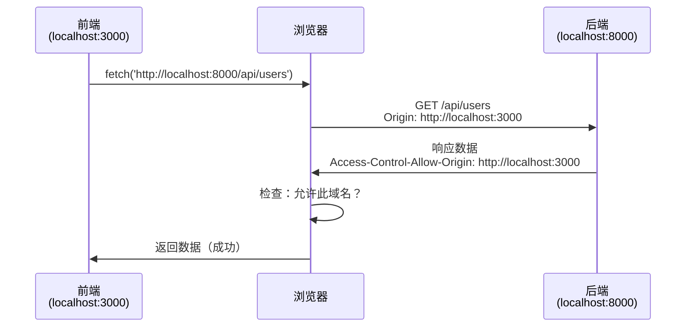
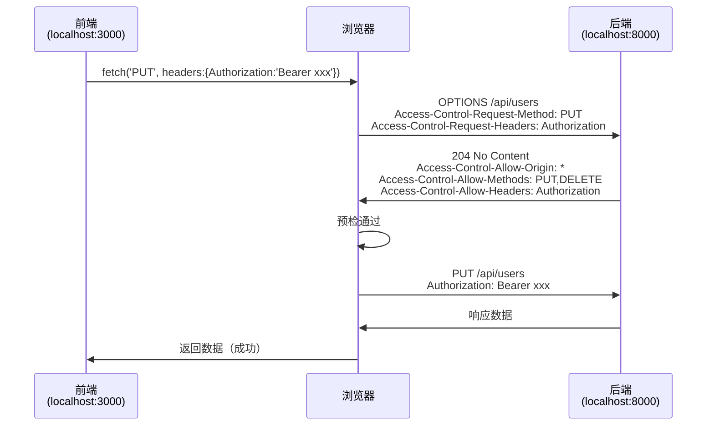

# CORS跨域

## 📚 核心概念

### 什么是跨域？

**定义**：协议、域名、端口任一不同即为跨域

**同源定义**：
```
协议 + 域名 + 端口 完全相同
```

**示例**：
```
https://example.com:8000/api/users
vs
https://example.com:8001/api/users  ← 跨域！（端口不同）

vs
http://example.com:8000/api/users   ← 跨域！（协议不同）

vs
https://www.example.com:8000/api/users ← 跨域！（子域名不同）

vs
https://another.com:8000/api/users  ← 跨域！（域名不同）
```

---

## 🛡️ 为什么需要CORS？

### 场景示例（CSRF攻击防护）

```
用户刚登录银行网站：https://bank.com
浏览器存储Cookie：session_id=abc123

用户访问恶意网站：https://evil-site.com
恶意网站的JavaScript代码：
fetch('https://bank.com/api/transfer', {
  method: 'POST',
  body: { to: 'hacker', amount: 10000 }
});

如果没有CORS限制：
→ 浏览器自动带上银行的Cookie
→ 银行服务器以为是用户操作
→ 钱被转走了！💸
```

**CORS的作用**：
```javascript
// 恶意网站发起跨域请求
fetch('https://bank.com/api/transfer')

浏览器检查：
  → 来源：evil-site.com
  → 目标：bank.com
  → 跨域！需要bank.com允许

bank.com的响应头：
  Access-Control-Allow-Origin: https://evil-site.com ❌ 不存在
  → 浏览器拒绝响应
  → 恶意网站拿不到数据 ✅ 安全！
```

---

## 🔍 CORS工作流程

### 简单请求（GET、简单POST）

**定义**：
- GET请求
- HEAD请求
- POST请求（Content-Type为：application/x-www-form-urlencoded、multipart/form-data、text/plain）

**流程**：


**代码示例**：
```javascript
// 前端请求
fetch('http://localhost:8000/api/public')
  .then(res => res.json())
  .then(data => console.log(data));

// 请求头（浏览器自动添加）
// Origin: http://localhost:3000

// 响应头（后端设置）
// Access-Control-Allow-Origin: http://localhost:3000
```

---

### 复杂请求（PUT、DELETE、自定义头）

**什么是复杂请求？**
- PUT、DELETE、PATCH
- Content-Type为application/json
- 自定义请求头（如Authorization）

**流程（两次请求）**：


**代码示例**：
```javascript
// 前端发起PUT请求
fetch('http://localhost:8000/api/users/1', {
  method: 'PUT',
  headers: {
    'Content-Type': 'application/json',
    'Authorization': 'Bearer xxx'
  },
  body: JSON.stringify({ name: '新名字' })
});

// 第一步：OPTIONS预检请求
// OPTIONS /api/users/1 HTTP/1.1
// Origin: http://localhost:3000
// Access-Control-Request-Method: PUT
// Access-Control-Request-Headers: Content-Type, Authorization

// 第二步：服务器响应
// HTTP/1.1 204 No Content
// Access-Control-Allow-Origin: http://localhost:3000
// Access-Control-Allow-Methods: GET, POST, PUT, DELETE
// Access-Control-Allow-Headers: Content-Type, Authorization

// 第三步：真实PUT请求
// PUT /api/users/1 HTTP/1.1
// Authorization: Bearer xxx
// { "name": "新名字" }
```

---

## 💻 Express中配置CORS

### 安装
```bash
npm install cors
```

### 基础用法

**1. 允许所有域名（不安全，仅开发环境）**
```javascript
const cors = require('cors');
app.use(cors());
```

**2. 白名单特定域名（推荐）**
```javascript
app.use(cors({
  origin: ['http://localhost:3000', 'https://my-frontend.com']
}));
```

**3. 动态白名单**
```javascript
const corsOptions = {
  origin: function (origin, callback) {
    const whitelist = ['http://localhost:3000', 'https://example.com'];
    if (!origin || whitelist.indexOf(origin) !== -1) {
      callback(null, true);  // 允许
    } else {
      callback(new Error('Not allowed by CORS'));  // 拒绝
    }
  }
};
app.use(cors(corsOptions));
```

**4. 允许复杂请求**
```javascript
app.use(cors({
  origin: 'http://localhost:3000',
  methods: ['GET', 'POST', 'PUT', 'DELETE', 'OPTIONS'],
  allowedHeaders: ['Content-Type', 'Authorization'],
  credentials: true  // 允许携带Cookie
}));
```

**5. 单个路由配置**
```javascript
app.get('/api/public', cors(), (req, res) => {
  res.json({ message: '公开接口' });
});

app.delete('/api/users/:id', cors({
  methods: ['DELETE']
}), (req, res) => {
  res.json({ message: '删除成功' });
});
```

---

## ⚠️ 生产环境最佳实践

### 1. 使用白名单
```javascript
// ❌ 不要这样做
app.use(cors({ origin: '*' }));  // 允许所有域名（危险！）

// ✅ 应该这样做
app.use(cors({
  origin: process.env.ALLOWED_ORIGINS.split(',')  // 从环境变量读取
}));
```

### 2. 只允许必要的HTTP方法
```javascript
app.use(cors({
  methods: ['GET', 'POST', 'PUT']  // 不需要DELETE就不要允许
}));
```

### 3. 只允许必要的请求头
```javascript
app.use(cors({
  allowedHeaders: ['Content-Type', 'Authorization']  // 只允许必要的头
}));
```

### 4. 环境变量配置
```bash
# .env
ALLOWED_ORIGINS=http://localhost:3000,https://my-frontend.com
```

```javascript
// app.js
const allowedOrigins = process.env.ALLOWED_ORIGINS.split(',');
app.use(cors({
  origin: allowedOrigins
}));
```

---

## 🧪 测试场景

### 场景1：同源请求（不需要CORS）
```
前端：http://localhost:3000
后端：http://localhost:3000
结果：✅ 不需要CORS，同源
```

### 场景2：跨域但白名单允许
```
前端：http://localhost:3000
后端：http://localhost:8000
白名单：['http://localhost:3000']
结果：✅ 成功（在白名单中）
```

### 场景3：跨域且不在白名单
```
前端：http://evil.com:3000
后端：http://localhost:8000
白名单：['http://localhost:3000']
结果：❌ 失败（CORS错误）
```

### 场景4：复杂请求
```
前端：http://localhost:3000
后端：http://localhost:8000
请求：PUT /api/users/1
流程：OPTIONS预检 → PUT真实请求
结果：✅ 成功（配置了allowedHeaders和methods）
```

---

## 🔗 知识点关联

- [[Cookie与Session]] - CORS与Cookie的关系
- [[XSS与CSRF防护]] - CSRF攻击防护
- [[JWT在Express中的实现]] - 前端如何携带Token

---

## 📝 常见错误

### 错误1：CORS policy错误
```
Access to fetch at 'http://localhost:8000/api/users' from origin 'http://localhost:3000'
has been blocked by CORS policy
```

**原因**：后端没有配置CORS或白名单不包含前端域名

**解决**：在后端添加cors中间件并配置白名单

---

### 错误2：预检请求失败
```
Request header field authorization is not allowed by Access-Control-Allow-Headers
```

**原因**：后端没有在allowedHeaders中添加Authorization

**解决**：
```javascript
app.use(cors({
  allowedHeaders: ['Content-Type', 'Authorization']
}));
```

---

### 错误3：携带Cookie失败
```
Credentials flag is 'true', but Access-Control-Allow-Credentials is 'true'
```

**原因**：前端设置了credentials，但后端没有正确配置

**解决**：
```javascript
// 后端
app.use(cors({
  origin: 'http://localhost:3000',  // 不能是*
  credentials: true
}));

// 前端
fetch('http://localhost:8000/api/users', {
  credentials: 'include'  // 携带Cookie
});
```

---

## 💡 总结

**CORS作用**：
- 防止恶意网站窃取用户数据
- 浏览器强制执行的安全策略

**简单vs复杂**：
- 简单：GET、简单POST（不需要预检）
- 复杂：PUT、DELETE、自定义头（需要OPTIONS预检）

**配置要点**：
- ✅ 使用白名单（不要用*）
- ✅ 只允许必要的方法和头
- ✅ 生产环境使用环境变量
- ✅ 测试前后端联调

**记住**：CORS是浏览器限制，Postman/curl不受限制
