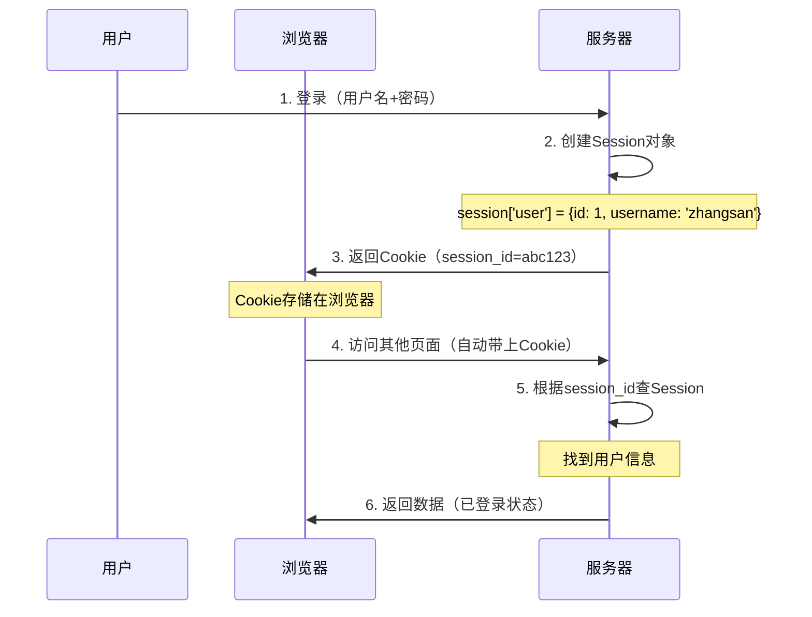

# Cookie与Session

## 📚 核心概念

### HTTP无状态性
HTTP协议本身是无状态的，每个请求都是独立的，服务器默认不会记住之前的请求状态。

**问题**：用户登录后，如何保持登录状态？

**解决方案**：Cookie + Session

---

### Cookie（客户端存储）

**定义**：浏览器存储的小型文本文件

**特点**：
- 📍 **存储位置**：客户端（浏览器）
- 🔄 **自动发送**：每次请求都会自动带上Cookie
- 📦 **容量限制**：4KB
- ⏰ **过期时间**：可设置（`Expires`、`Max-Age`）
- 🌐 **域名绑定**：只发送给相同域名

**代码示例**：
```javascript
// 设置Cookie
res.cookie('session_id', 'abc123', {
  expires: new Date(Date.now() + 3600000),  // 1小时后过期
  httpOnly: true,  // 只能HTTP访问，防止XSS
  secure: true,    // 只能HTTPS传输
  sameSite: 'strict'  // 防止CSRF
});

// 读取Cookie
const sessionId = req.cookies.session_id;
```

**三种存储对比**：
| 特性 | Cookie | localStorage | sessionStorage |
|------|--------|--------------|----------------|
| 容量 | 4KB | 5-10MB | 5-10MB |
| 发送方式 | 🔄 自动发送 | ❌ 不自动发送 | ❌ 不自动发送 |
| 过期时间 | 可设置 | ⏰ 永久（除非手动删除） | 🔄 关闭标签页清除 |
| 作用域 | 同域名 | 同域名 | **当前标签页** |

---

### Session（服务端存储）

**定义**：服务器内存中的用户数据对象

**特点**：
- 📍 **存储位置**：服务器（内存/数据库/Redis）
- 🔐 **安全**：敏感数据不暴露给客户端
- 💾 **持久化**：服务器重启后可能丢失（除非用数据库）

**工作流程**：


**代码示例**：
```javascript
// 安装express-session
// npm install express-session

const session = require('express-session');

app.use(session({
  secret: 'secret-key',  // 签名密钥
  resave: false,         // 不强制保存
  saveUninitialized: true,  // 初始化session保存
  cookie: {
    maxAge: 3600000,     // 1小时
    secure: false,       // HTTPS（开发环境设为false）
    httpOnly: true       // 防止XSS
  }
}));

// 登录时保存Session
app.post('/login', (req, res) => {
  req.session.user = {
    id: 1,
    username: 'zhangsan'
  };
  res.json({ success: true });
});

// 访问时读取Session
app.get('/profile', (req, res) => {
  if (req.session.user) {
    res.json({ user: req.session.user });
  } else {
    res.status(401).json({ error: '未登录' });
  }
});
```

---

## 🔄 Session vs JWT

| 特性 | Session | JWT |
|------|---------|-----|
| **存储位置** | 服务器（内存/数据库） | 客户端（浏览器） |
| **状态** | 有状态（需要查数据库） | 无状态（不需要查） |
| **扩展性** | ❌ 差（多服务器需要同步） | ✅ 好（每个服务器都能验证） |
| **安全性** | ✅ 可强制失效（删除Session） | ⚠️ 无法主动失效（只能等过期） |
| **适用场景** | 传统Web应用 | 微服务、移动端、跨域 |

**Session流程**：
```
登录 → 创建Session → 返回Cookie(session_id) → 每次请求带Cookie → 服务器查Session
```

**JWT流程**：
```
登录 → 生成JWT → 返回Token → 每次请求带Token → 服务器验证Token签名
```

---

## 💡 实际应用

### 1. 用户登录保持
```javascript
// 使用Cookie + Session
app.post('/login', (req, res) => {
  // 验证密码
  if (password === hashedPassword) {
    req.session.user = { id, username };
    res.json({ success: true });
  }
});

// 使用JWT
app.post('/login', (req, res) => {
  // 验证密码
  if (password === hashedPassword) {
    const token = jwt.sign({ id, username }, JWT_SECRET, { expiresIn: '7d' });
    res.json({ token });  // 前端存储在localStorage
  }
});
```

### 2. 刷新页面保持登录
- **Cookie**：自动发送，刷新页面自动带上 ✅
- **localStorage**：需要手动读取并发送

### 3. 登出
```javascript
// Session方式
app.post('/logout', (req, res) => {
  req.session.destroy();  // 删除Session
  res.clearCookie('session_id');  // 清除Cookie
  res.json({ success: true });
});

// JWT方式
app.post('/logout', (req, res) => {
  // JWT无法主动失效，只能等过期
  // 解决方案：前端删除localStorage中的token
  res.json({ success: true });
});
```

---

## ⚠️ 安全注意事项

### Cookie安全
```javascript
res.cookie('session_id', 'abc123', {
  httpOnly: true,    // ✅ 防止XSS读取Cookie
  secure: true,      // ✅ 只能HTTPS传输
  sameSite: 'strict',// ✅ 防止CSRF攻击
  maxAge: 3600000    // ✅ 设置过期时间
});
```

### Session安全
- ✅ 使用强密钥（`secret`）
- ✅ 定期轮换Session ID
- ✅ 设置合理过期时间
- ✅ 敏感操作需要重新验证

---

## 🔗 知识点关联

- [[JWT原理]] - 另一种认证方式
- [[Token刷新机制]] - JWT的Token刷新
- [[XSS与CSRF防护]] - Cookie相关的安全防护
- [[密码加密]] - 用户密码存储加密

---

## 📝 总结

**Cookie**：
- 存在客户端（浏览器）
- 自动发送（保持登录状态）
- 容量小（4KB）

**Session**：
- 存在服务器（内存/数据库）
- 安全（敏感数据不暴露）
- 需要Cookie存储session_id

**选择建议**：
- 传统Web应用 → Cookie + Session
- 微服务/移动端/跨域 → JWT
