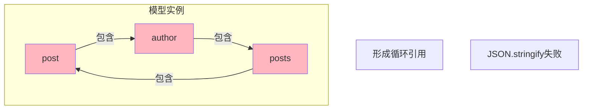
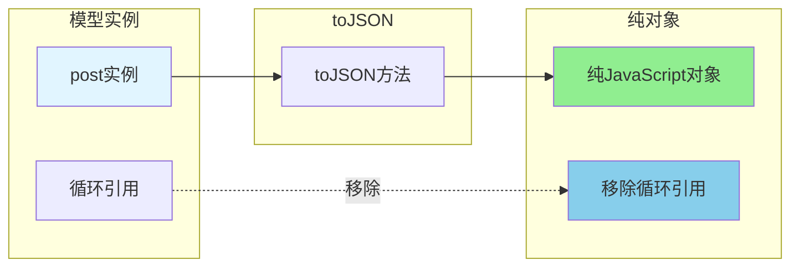

---
tags:
  - 易错点
  - Sequelize
  - 错误
  - TypeError
创建时间: 2026-03-25
更新时间: 2026-03-25
错误类型: TypeError
错误级别: ⭐⭐⭐⭐⭐ (常见)
解决状态: ✅ 已解决
相关主题: [[Sequelize模型关联]] [[Sequelize CRUD操作]]
---

# Sequelize循环引用错误

## 🔴 错误信息

```
TypeError: Converting circular structure to JSON
    at JSON.stringify (<anonymous>)
    at res.json (express/lib/response.js:254)
    at getPostById (file:///path/to/controller.js:106)
```

---

## 🤔 错误场景

### 代码示例

```javascript
// GET /api/posts/:id
const getPostById = async (req, res) => {
  const { id } = req.params;

  const post = await Post.findOne({
    where: { id },
    include: [{
      model: User,
      as: 'author',
      attributes: ['username', 'nickname', 'avatar']
    }]
  });

  // ❌ 错误：直接返回模型实例
  res.json({
    success: true,
    data: post  // ← post是模型实例，包含循环引用
  });
};
```

---

## 🔍 错误原因

### Sequelize模型实例包含循环关联

```javascript
post (模型实例)
  ├─ data: { id, title, content, ... }
  ├─ author (User模型实例)
  │   ├─ data: { id, username, ... }
  │   └─ posts (Post模型实例数组)  ← 循环！
  │       └─ post → author → posts → post → ...
  └─ _model: Post (Sequelize内部属性)
```

**为什么会有循环？**
- `Post.belongsTo(User)` → Post包含author
- `User.hasMany(Post)` → User包含posts
- 形成双向引用：post → author → posts → post

---

## ✅ 解决方案

### 方案1: 使用toJSON() ⭐⭐⭐⭐⭐

```javascript
// ✅ 正确：转换为纯JavaScript对象
res.json({
  success: true,
  data: post.toJSON()  // ← 关键！
});
```

**toJSON()的作用**:
- ✅ 移除Sequelize内部属性（_model, _options等）
- ✅ 移除循环引用
- ✅ 只保留数据字段

### 转换前后对比

**转换前（模型实例）**:
```javascript
{
  id: 1,
  title: '文章标题',
  dataValues: { id: 1, title: '...' },  // Sequelize内部
  _model: Post,                          // Sequelize内部
  _options: {},                          // Sequelize内部
  author: {
    id: 5,
    username: 'admin',
    posts: [...]  // ← 循环引用！
  }
}
```

**转换后（纯对象）**:
```javascript
{
  id: 1,
  title: '文章标题',
  content: '...',
  created_at: '2026-03-25 10:00:00',
  updated_at: '2026-03-25 10:00:00',
  author: {
    id: 5,
    username: 'admin',
    nickname: '管理员',
    avatar: 'avatar.jpg'
    // ← 没有posts循环引用
  }
}
```

---

## 📋 什么时候需要toJSON()？

### ✅ 需要 toJSON()

```javascript
// 1. findOne返回单个模型实例
const post = await Post.findOne({ where: { id } });
res.json({ data: post.toJSON() });

// 2. create返回的单个对象
const newUser = await User.create({ username });
res.json({ data: newUser.toJSON() });  // ← 建议

// 3. 嵌套include的查询
const post = await Post.findOne({
  include: [{ model: User, as: 'author' }]
});
res.json({ data: post.toJSON() });
```

### ❌ 不需要 toJSON()

```javascript
// 1. findAll返回数组（自动toJSON）
const posts = await Post.findAll();
res.json({ data: posts });  // ✅ 不需要toJSON()

// 2. findAndCountAll返回的结果
const { rows, count } = await Post.findAndCountAll({
  include: [{ model: User, as: 'author' }]
});
res.json({ data: rows });  // ✅ rows已经自动toJSON()
```

### 经验法则

| 查询方法 | 是否需要toJSON() | 原因 |
|---------|-----------------|------|
| findOne() | ✅ 需要 | 返回模型实例 |
| findAll() | ❌ 不需要 | 返回数组（已自动toJSON） |
| findAndCountAll() | ❌ 不需要 | rows已自动toJSON |
| create() | ✅ 建议 | 返回模型实例 |
| update() | ✅ 需要 | 返回模型实例 |

---

## 🛠️ 其他解决方案

### 方案2: 使用中间件自动转换

```javascript
// 自动转换Sequelize模型实例
app.use((req, res, next) => {
  const originalJson = res.json;
  res.json = function(data) {
    if (data.data && typeof data.data.toJSON === 'function') {
      data.data = data.data.toJSON();
    }
    return originalJson.call(this, data);
  };
  next();
});
```

### 方案3: 模型中配置toJSON

```javascript
const Post = sequelize.define('Post', {
  // ...
}, {
  // ...
  // 自定义toJSON行为
  instanceMethods: {
    toJSON() {
      const values = { ...this.get() };
      // 移除敏感字段
      delete values.password;
      return values;
    }
  }
});
```

---

## 🎯 最佳实践

### ✅ 推荐做法

1. ✅ **统一使用toJSON()**
   ```javascript
   // 所有findOne/create/update返回的实例都toJSON()
   res.json({ data: instance ? instance.toJSON() : null });
   ```

2. ✅ **区分返回类型**
   ```javascript
   // 单个实例
   const post = await Post.findOne({ ... });
   res.json({ data: post.toJSON() });

   // 数组（不需要）
   const posts = await Post.findAll({ ... });
   res.json({ data: posts });
   ```

3. ✅ **API响应统一格式**
   ```javascript
   res.json({
     success: true,
     data: instance ? instance.toJSON() : null,
     message: '操作成功'
   });
   ```

### ❌ 避免做法

1. ❌ 直接返回模型实例
   ```javascript
   res.json({ data: post });  // ← 可能报错
   ```

2. ❌ 忘记检查类型
   ```javascript
   res.json({ data: post });  // ← 不知道是否是实例还是数组
   ```

3. ❌ 混用返回格式
   ```javascript
   // 有时toJSON()，有时不用，不一致
   ```

---

## 🔗 相关错误

### 错误1: findAndCountAll忘记处理count

```javascript
// ❌ 错误
const { rows } = await Post.findAndCountAll();
res.json({ data: rows });
// 没有返回总数，前端无法分页

// ✅ 正确
const { rows, count } = await Post.findAndCountAll();
res.json({
  data: {
    list: rows,
    total: count,
    page: page,
    pageSize: pageSize,
    totalPages: Math.ceil(count / pageSize)
  }
});
```

### 错误2: 忘记使用as别名

```javascript
// 定义关联时
User.hasMany(Post, { as: 'posts' });

// ❌ 错误：忘记使用as
const user = await User.findOne({
  include: [Post]
});
// Error: Association 'Post' not found

// ✅ 正确：使用as
const user = await User.findOne({
  include: [{ model: Post, as: 'posts' }]
});
```

### 错误3: 导入方式错误

```javascript
// ❌ 错误
const sequelize = require('../config/sequelize');
const User = sequelize.define('User', {...});
// TypeError: sequelize.define is not a function

// ✅ 正确（解构导入）
const { sequelize } = require('../config/sequelize');
const User = sequelize.define('User', {...});
```

---

## 🎨 可视化图表

### 循环引用问题



### toJSON()解决方案



---

## 💡 关键要点

1. ✅ **问题**: Sequelize模型实例包含循环关联，无法JSON.stringify()
2. ✅ **原因**: 双向关联（post → author → posts → post）
3. ✅ **解决**: 使用`instance.toJSON()`转换为纯对象
4. ✅ **记住**: findOne、create返回的实例建议toJSON()
5. ✅ **注意**: findAll、findAndCountAll返回的数组不需要
6. ✅ **最佳实践**: 统一使用toJSON()避免错误

---

## 📝 快速参考

### 常见模式

```javascript
// ✅ 单个查询
const post = await Post.findOne({ where: { id } });
res.json({ data: post.toJSON() });

// ✅ 列表查询（不需要toJSON）
const posts = await Post.findAll();
res.json({ data: posts });

// ✅ 分页查询（rows不需要toJSON）
const { rows, count } = await Post.findAndCountAll({ ... });
res.json({ data: { list: rows, total: count } });

// ✅ 创建用户
const user = await User.create({ username });
res.json({ data: user.toJSON() });

// ✅ 更新后返回
const post = await Post.findOne({ where: { id } });
await post.update({ title: 'New' });
res.json({ data: post.toJSON() });
```

---

**错误级别**: ⭐⭐⭐⭐⭐ (必须掌握)
**发生频率**: 高（每次返回Sequelize模型实例时）
**解决难度**: 简单（一行代码）
**预防方法**: 统一使用toJSON()

---

**最后更新**: 2026-03-25
**实战项目**: [[../../projects/11-personal-blog]]
