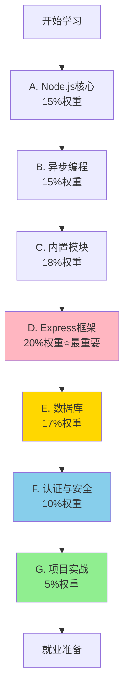
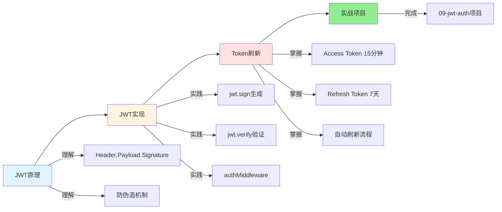
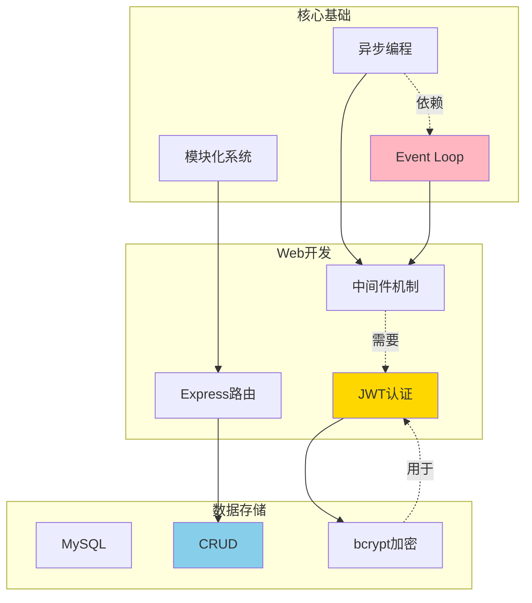
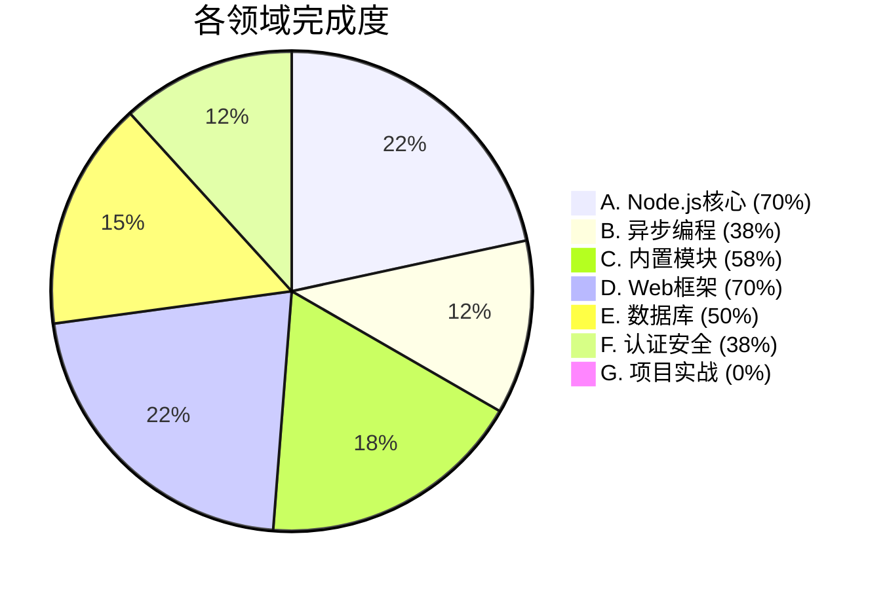

---
tags:
  - 索引
  - 知识点
创建时间: 2026-03-21
更新时间: 2026-03-21
---

# Node.js 知识点索引

> **已掌握主题**: 34/73 (47%)
> **学习时间**: 7天
> **最后更新**: 2026-03-21

---

## 📚 按领域查找

### A. Node.js核心基础 (15%权重) ✅ 7/10

- ✅ [[A-Nodejs核心/CommonJS vs ES6模块化]]
- ✅ [[A-Nodejs核心/npm包管理器使用]]
- ✅ [[A-Nodejs核心/package.json详解]]
- ✅ [[A-Nodejs核心/Buffer缓冲区]]
- ✅ [[A-Nodejs核心/全局对象]]
- ✅ [[A-Nodejs核心/模块加载机制]]
- [ ] A.1 - Node.js环境安装与配置
- [ ] A.2 - ES6核心语法
- [ ] A.9 - Node.js的执行模型
- [ ] A.10 - 包的发布与私有npm

---

### B. 异步编程 (15%权重) ✅ 3/8

- ✅ [[B-异步编程/Promise基础]]
- ✅ [[B-异步编程/async await]]
- ✅ [[B-异步编程/Event Loop事件循环机制]]
- [ ] B.1 - 同步 vs 异步
- [ ] B.2 - 回调函数与回调地狱
- [ ] B.4 - Promise链式调用
- [ ] B.7 - 宏任务 vs 微任务（深入）
- [ ] B.8 - 错误处理

---

### C. 内置模块 (18%权重) ✅ 7/12

- ✅ [[C-内置模块/fs文件写入]]
- ✅ [[C-内置模块/fs文件读取]]
- ✅ [[C-内置模块/fs流式操作]]
- ✅ [[C-内置模块/path路径处理]]
- ✅ [[C-内置模块/http创建服务器]]
- ✅ [[C-内置模块/events事件发射器]]
- ✅ [[C-内置模块/url模块]]
- [ ] C.4 - fs文件信息（stat/readdir）
- [ ] C.7 - http请求响应
- [ ] C.10 - crypto加密
- [ ] C.12 - 其他模块（os、util）

---

### D. Web框架 (20%权重) ⭐ ✅ 7/10

- ✅ [[D-Express框架/Express简介与安装]]
- ✅ [[D-Express框架/Express路由]]
- ✅ [[D-Express框架/Express中间件机制]]
- ✅ [[D-Express框架/常用中间件]]
- ✅ [[D-Express框架/模块化路由]]
- ✅ [[D-Express框架/错误处理中间件]]
- ✅ [[D-Express框架/Multer文件上传]]
- ✅ [[D-Express框架/express-validator参数验证]]
- [ ] D.5 - 静态资源服务（进阶）
- [ ] D.6 - RESTful API设计规范
- [ ] D.7 - 路由参数处理（进阶）
- [ ] D.10 - Express最佳实践

---

### E. 数据库 (17%权重) ✅ 5/10

- ✅ [[E-数据库/MySQL安装与配置]]
- ✅ [[E-数据库/SQL基础语法]]
- ✅ [[E-数据库/数据库设计基础]]
- ✅ [[E-数据库/Node.js连接mysql2]]
- ✅ [[E-数据库/CRUD操作实现]]
- [ ] E.6 - SQL注入防护
- [ ] E.7 - 事务处理
- [ ] E.8 - ORM（Sequelize基础）
- [ ] E.9 - Sequelize模型
- [ ] E.10 - 数据库连接池配置

---

### F. 认证与安全 (10%权重) ✅ 3/8

- ✅ [[F-认证与安全/JWT原理]]
- ✅ [[F-认证与安全/JWT在Express中的实现]]
- ✅ [[F-认证与安全/Token刷新机制]]
- ✅ [[F-认证与安全/express-validator数据验证]]
- [ ] F.1 - Cookie/Session
- [ ] F.5 - CORS跨域问题
- [ ] F.7 - 密码加密（bcrypt深入）
- [ ] F.8 - XSS/CSRF防护

---

### G. 项目实战 (5%权重) ⏳ 0/5

- [ ] G.1 - 文件管理工具
- [ ] G.2 - 静态资源服务
- [ ] G.3 - 个人博客API
- [ ] G.4 - 电影管理系统
- [ ] G.5 - 项目部署

---

## 🔥 学习重点（按重要性）

### ⭐⭐⭐⭐⭐ 最重要（必须掌握）

1. **Express框架** (D) - 20%权重
   - Express路由
   - Express中间件机制
   - 模块化路由
   - 错误处理

2. **数据库** (E) - 17%权重
   - SQL基础语法
   - CRUD操作
   - Node.js连接mysql2

3. **认证与安全** (F) - 10%权重
   - JWT原理
   - JWT实现
   - Token刷新机制

---

### ⭐⭐⭐⭐ 重要（面试常考）

1. **异步编程** (B) - 15%权重
   - Promise基础
   - async/await
   - Event Loop

2. **内置模块** (C) - 18%权重
   - fs文件操作
   - path路径处理
   - http服务器

---

### ⭐⭐⭐ 基础（必须了解）

1. **Node.js核心** (A) - 15%权重
   - 模块化系统
   - npm包管理
   - Buffer缓冲区

---

## 📅 学习时间线

### 第1周 (3/13-3/19)
- ✅ A. Node.js核心 (7/10)
- ✅ B. 异步编程 (2/8)
- ✅ C. 内置模块 (7/12)

### 第2周 (3/20-3/26)
- ✅ D. Web框架 (7/10)
- ✅ E. 数据库 (3/10)

### 第3周 (3/27-4/2) - 今天
- ✅ E. 数据库完成 (5/10)
- ✅ F. 认证与安全 (3/8)

---

## 🎯 快速导航

### 按主题类型

**理论概念**:
- [[Event Loop事件循环机制]]
- [[CommonJS vs ES6模块化]]
- [[JWT原理]]

**实战技巧**:
- [[Token刷新机制]]
- [[Express中间件机制]]
- [[错误处理中间件]]

**代码示例**:
- [[../../projects/09-jwt-auth]] - JWT认证系统
- [[../../projects/08-user-register-complete]] - 用户注册系统
- [[../../projects/07-mysql-crud]] - MySQL CRUD

**常见错误**:
- [[../../03-易错点与陷阱]]

---

## 📊 进度统计

| 领域 | 权重 | 已掌握 | 进度 | 状态 |
|------|------|--------|------|------|
| A. Node.js核心 | 15% | 7/10 | 70% | 🟡 |
| B. 异步编程 | 15% | 3/8 | 38% | 🟡 |
| C. 内置模块 | 18% | 7/12 | 58% | 🟡 |
| D. Web框架 | 20% | 7/10 | 70% | 🟡 |
| E. 数据库 | 17% | 5/10 | 50% | 🟡 |
| F. 认证安全 | 10% | 3/8 | 38% | 🟡 |
| G. 项目实战 | 5% | 0/5 | 0% | ⚪ |

**总进度**: 34/73 = **47%**

---

## 🔍 查找技巧

### 按关键词

- **模块化** → [[A-Nodejs核心]]
- **异步** → [[B-异步编程]]
- **文件操作** → [[C-内置模块]]
- **Express** → [[D-Express框架]]
- **数据库** → [[E-数据库]]
- **JWT** → [[F-认证与安全]]

### 按难度

- **简单** (⭐) → npm、Buffer、SQL基础
- **中等** (⭐⭐) → Promise、Express路由、CRUD
- **困难** (⭐⭐⭐) → Event Loop、JWT、Token刷新

### 按重要性

- **就业必考** → Express、数据库、JWT、Event Loop
- **面试常考** → 异步编程、内置模块
- **基础必备** → 模块化、npm

---

## 📝 待补充内容

- [ ] 所有知识点的详细笔记
- [ ] 代码示例索引
- [ ] 易错点总结
- [ ] 面试题库
- [ ] 前后端对比

---

**最后更新**: 2026-03-21
**下次更新**: 每完成一个主题更新一次
---

## 🎨 学习路径可视化

### 知识领域学习顺序

### 今日学习路径（2026-03-21）

### 知识点关联图

### 进度可视化

